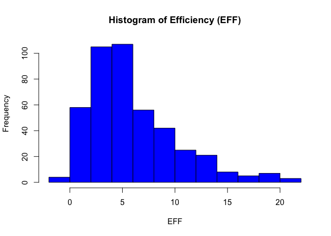
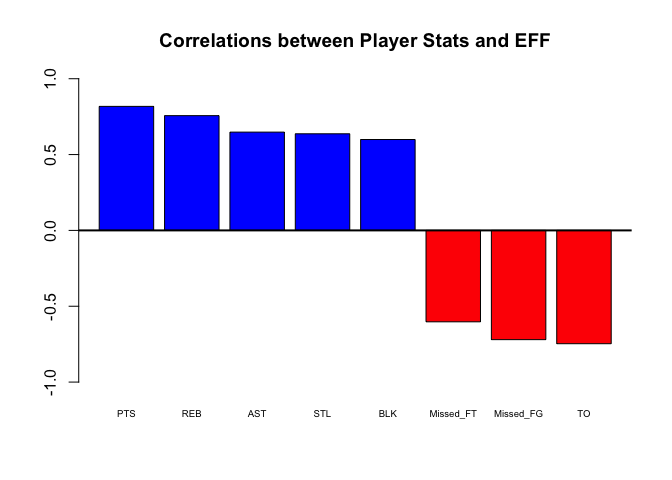
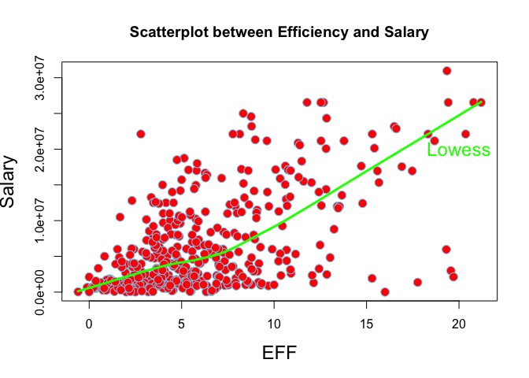
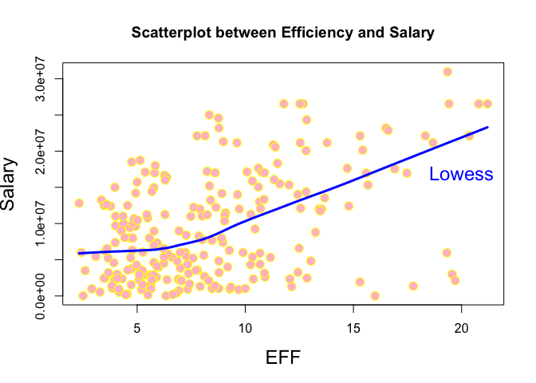

hw02-donggyun-kim
================
Donggyun Kim
9/28/2017

1) Create a data dictionary
---------------------------

[A data dictionary](https://github.com/dgyunkim/stat133-hws-fall17/blob/master/hw02/data/nba2017-player-statistics-dictionary.md)

2) Import the data in R
-----------------------

-   Import data with "base"

``` r
setwd("~/Desktop/STAT 133/stat133-hws-fall17/hw02/data")
nba2017 <- read.csv("nba2017-player-statistics.csv", 
                colClasses = c("character", "character", "factor", "character", "double", rep("integer", 19)))
str(nba2017)
```

    ## 'data.frame':    441 obs. of  24 variables:
    ##  $ Player      : chr  "Al Horford" "Amir Johnson" "Avery Bradley" "Demetrius Jackson" ...
    ##  $ Team        : chr  "BOS" "BOS" "BOS" "BOS" ...
    ##  $ Position    : Factor w/ 5 levels "C","PF","PG",..: 1 2 5 3 4 3 4 5 4 2 ...
    ##  $ Experience  : chr  "9" "11" "6" "R" ...
    ##  $ Salary      : num  26540100 12000000 8269663 1450000 1410598 ...
    ##  $ Rank        : int  4 6 5 15 11 1 3 13 8 10 ...
    ##  $ Age         : int  30 29 26 22 31 27 26 21 20 29 ...
    ##  $ GP          : int  68 80 55 5 47 76 72 29 78 78 ...
    ##  $ GS          : int  68 77 55 0 0 76 72 0 20 6 ...
    ##  $ MIN         : int  2193 1608 1835 17 538 2569 2335 220 1341 1232 ...
    ##  $ FGM         : int  379 213 359 3 95 682 333 25 192 114 ...
    ##  $ FGA         : int  801 370 775 4 232 1473 720 58 423 262 ...
    ##  $ Points3     : int  86 27 108 1 39 245 157 12 46 45 ...
    ##  $ Points3_atts: int  242 66 277 1 111 646 394 35 135 130 ...
    ##  $ Points2     : int  293 186 251 2 56 437 176 13 146 69 ...
    ##  $ Points2_atts: int  559 304 498 3 121 827 326 23 288 132 ...
    ##  $ FTM         : int  108 67 68 3 33 590 176 6 85 26 ...
    ##  $ FTA         : int  135 100 93 6 41 649 217 9 124 37 ...
    ##  $ OREB        : int  95 117 65 2 17 43 48 6 45 60 ...
    ##  $ DREB        : int  369 248 269 2 68 162 367 20 175 213 ...
    ##  $ AST         : int  337 140 121 3 33 449 155 4 64 71 ...
    ##  $ STL         : int  52 52 68 0 9 70 72 10 35 26 ...
    ##  $ BLK         : int  87 62 11 0 7 13 23 2 18 17 ...
    ##  $ TO          : int  116 77 88 0 25 210 79 4 68 39 ...

-   Import data with "readr"

``` r
setwd("~/Desktop/STAT 133/stat133-hws-fall17/hw02/data")
nba2017 <- read_csv("nba2017-player-statistics.csv", 
                          col_types = list(Position = col_factor(c("C", "PF", "SF", "PG", "SG"))))
str(nba2017)
```

    ## Classes 'tbl_df', 'tbl' and 'data.frame':    441 obs. of  24 variables:
    ##  $ Player      : chr  "Al Horford" "Amir Johnson" "Avery Bradley" "Demetrius Jackson" ...
    ##  $ Team        : chr  "BOS" "BOS" "BOS" "BOS" ...
    ##  $ Position    : Factor w/ 5 levels "C","PF","SF",..: 1 2 5 4 3 4 3 5 3 2 ...
    ##  $ Experience  : chr  "9" "11" "6" "R" ...
    ##  $ Salary      : num  26540100 12000000 8269663 1450000 1410598 ...
    ##  $ Rank        : int  4 6 5 15 11 1 3 13 8 10 ...
    ##  $ Age         : int  30 29 26 22 31 27 26 21 20 29 ...
    ##  $ GP          : int  68 80 55 5 47 76 72 29 78 78 ...
    ##  $ GS          : int  68 77 55 0 0 76 72 0 20 6 ...
    ##  $ MIN         : int  2193 1608 1835 17 538 2569 2335 220 1341 1232 ...
    ##  $ FGM         : int  379 213 359 3 95 682 333 25 192 114 ...
    ##  $ FGA         : int  801 370 775 4 232 1473 720 58 423 262 ...
    ##  $ Points3     : int  86 27 108 1 39 245 157 12 46 45 ...
    ##  $ Points3_atts: int  242 66 277 1 111 646 394 35 135 130 ...
    ##  $ Points2     : int  293 186 251 2 56 437 176 13 146 69 ...
    ##  $ Points2_atts: int  559 304 498 3 121 827 326 23 288 132 ...
    ##  $ FTM         : int  108 67 68 3 33 590 176 6 85 26 ...
    ##  $ FTA         : int  135 100 93 6 41 649 217 9 124 37 ...
    ##  $ OREB        : int  95 117 65 2 17 43 48 6 45 60 ...
    ##  $ DREB        : int  369 248 269 2 68 162 367 20 175 213 ...
    ##  $ AST         : int  337 140 121 3 33 449 155 4 64 71 ...
    ##  $ STL         : int  52 52 68 0 9 70 72 10 35 26 ...
    ##  $ BLK         : int  87 62 11 0 7 13 23 2 18 17 ...
    ##  $ TO          : int  116 77 88 0 25 210 79 4 68 39 ...
    ##  - attr(*, "spec")=List of 2
    ##   ..$ cols   :List of 24
    ##   .. ..$ Player      : list()
    ##   .. .. ..- attr(*, "class")= chr  "collector_character" "collector"
    ##   .. ..$ Team        : list()
    ##   .. .. ..- attr(*, "class")= chr  "collector_character" "collector"
    ##   .. ..$ Position    :List of 3
    ##   .. .. ..$ levels    : chr  "C" "PF" "SF" "PG" ...
    ##   .. .. ..$ ordered   : logi FALSE
    ##   .. .. ..$ include_na: logi FALSE
    ##   .. .. ..- attr(*, "class")= chr  "collector_factor" "collector"
    ##   .. ..$ Experience  : list()
    ##   .. .. ..- attr(*, "class")= chr  "collector_character" "collector"
    ##   .. ..$ Salary      : list()
    ##   .. .. ..- attr(*, "class")= chr  "collector_double" "collector"
    ##   .. ..$ Rank        : list()
    ##   .. .. ..- attr(*, "class")= chr  "collector_integer" "collector"
    ##   .. ..$ Age         : list()
    ##   .. .. ..- attr(*, "class")= chr  "collector_integer" "collector"
    ##   .. ..$ GP          : list()
    ##   .. .. ..- attr(*, "class")= chr  "collector_integer" "collector"
    ##   .. ..$ GS          : list()
    ##   .. .. ..- attr(*, "class")= chr  "collector_integer" "collector"
    ##   .. ..$ MIN         : list()
    ##   .. .. ..- attr(*, "class")= chr  "collector_integer" "collector"
    ##   .. ..$ FGM         : list()
    ##   .. .. ..- attr(*, "class")= chr  "collector_integer" "collector"
    ##   .. ..$ FGA         : list()
    ##   .. .. ..- attr(*, "class")= chr  "collector_integer" "collector"
    ##   .. ..$ Points3     : list()
    ##   .. .. ..- attr(*, "class")= chr  "collector_integer" "collector"
    ##   .. ..$ Points3_atts: list()
    ##   .. .. ..- attr(*, "class")= chr  "collector_integer" "collector"
    ##   .. ..$ Points2     : list()
    ##   .. .. ..- attr(*, "class")= chr  "collector_integer" "collector"
    ##   .. ..$ Points2_atts: list()
    ##   .. .. ..- attr(*, "class")= chr  "collector_integer" "collector"
    ##   .. ..$ FTM         : list()
    ##   .. .. ..- attr(*, "class")= chr  "collector_integer" "collector"
    ##   .. ..$ FTA         : list()
    ##   .. .. ..- attr(*, "class")= chr  "collector_integer" "collector"
    ##   .. ..$ OREB        : list()
    ##   .. .. ..- attr(*, "class")= chr  "collector_integer" "collector"
    ##   .. ..$ DREB        : list()
    ##   .. .. ..- attr(*, "class")= chr  "collector_integer" "collector"
    ##   .. ..$ AST         : list()
    ##   .. .. ..- attr(*, "class")= chr  "collector_integer" "collector"
    ##   .. ..$ STL         : list()
    ##   .. .. ..- attr(*, "class")= chr  "collector_integer" "collector"
    ##   .. ..$ BLK         : list()
    ##   .. .. ..- attr(*, "class")= chr  "collector_integer" "collector"
    ##   .. ..$ TO          : list()
    ##   .. .. ..- attr(*, "class")= chr  "collector_integer" "collector"
    ##   ..$ default: list()
    ##   .. ..- attr(*, "class")= chr  "collector_guess" "collector"
    ##   ..- attr(*, "class")= chr "col_spec"

3) Right after importing the data
---------------------------------

-   Process on the column "Experience"

``` r
nba2017[["Experience"]][nba2017[["Experience"]] == "R"] <- "0"
nba2017$Experience <- as.integer(nba2017$Experience)
nba2017
```

    ## # A tibble: 441 x 24
    ##               Player  Team Position Experience   Salary  Rank   Age    GP
    ##                <chr> <chr>   <fctr>      <int>    <dbl> <int> <int> <int>
    ##  1        Al Horford   BOS        C          9 26540100     4    30    68
    ##  2      Amir Johnson   BOS       PF         11 12000000     6    29    80
    ##  3     Avery Bradley   BOS       SG          6  8269663     5    26    55
    ##  4 Demetrius Jackson   BOS       PG          0  1450000    15    22     5
    ##  5      Gerald Green   BOS       SF          9  1410598    11    31    47
    ##  6     Isaiah Thomas   BOS       PG          5  6587132     1    27    76
    ##  7       Jae Crowder   BOS       SF          4  6286408     3    26    72
    ##  8       James Young   BOS       SG          2  1825200    13    21    29
    ##  9      Jaylen Brown   BOS       SF          0  4743000     8    20    78
    ## 10     Jonas Jerebko   BOS       PF          6  5000000    10    29    78
    ## # ... with 431 more rows, and 16 more variables: GS <int>, MIN <int>,
    ## #   FGM <int>, FGA <int>, Points3 <int>, Points3_atts <int>,
    ## #   Points2 <int>, Points2_atts <int>, FTM <int>, FTA <int>, OREB <int>,
    ## #   DREB <int>, AST <int>, STL <int>, BLK <int>, TO <int>

4) Performance of players
-------------------------

-   Add new variables

``` r
nba2017$Missed_FG <- nba2017$FGA - nba2017$FGM
nba2017$Missed_FT <- nba2017$FTA - nba2017$FTM
nba2017$PTS <- nba2017$FGM + nba2017$FTM
nba2017$REB <- nba2017$OREB + nba2017$DREB
nba2017$MPG <- nba2017$MIN / nba2017$GP
```

-   Calculate and add EFF

``` r
nba2017$EFF <- (nba2017$PTS + nba2017$REB + nba2017$AST + nba2017$STL
                + nba2017$BLK - nba2017$Missed_FG - nba2017$Missed_FT - nba2017$TO) / nba2017$GP
```

-   Summary of EFF

``` r
summary(nba2017$EFF)
```

    ##    Min. 1st Qu.  Median    Mean 3rd Qu.    Max. 
    ##  -0.600   3.083   5.016   6.007   8.012  21.198

-   Histogram of Efficiency (EFF)

``` r
hist(nba2017$EFF, main = "Histogram of Efficiency (EFF)", xlab = "EFF", col = "Blue")
```



-   Display the player name, team, salary, and EFF value of the top-10 players by EFF in decreasing order

``` r
head(arrange(select(nba2017, Player, Team, Salary, EFF), desc(EFF)), 10)
```

    ## # A tibble: 10 x 4
    ##                   Player  Team   Salary      EFF
    ##                    <chr> <chr>    <dbl>    <dbl>
    ##  1     Russell Westbrook   OKC 26540100 21.19753
    ##  2          James Harden   HOU 26540100 20.79012
    ##  3         Anthony Davis   NOP 22116750 20.36000
    ##  4           Rudy Gobert   UTA  2121288 19.70370
    ##  5 Giannis Antetokounmpo   MIL  2995421 19.56250
    ##  6          Kevin Durant   GSW 26540100 19.41935
    ##  7          LeBron James   CLE 30963450 19.35135
    ##  8    Karl-Anthony Towns   MIN  5960160 19.31707
    ##  9        DeAndre Jordan   LAC 21165675 18.67901
    ## 10      Hassan Whiteside   MIA 22116750 18.32468

-   Provide the names of the players that have a negative EFF

``` r
select(filter(nba2017, EFF < 0), Player)
```

    ## # A tibble: 2 x 1
    ##            Player
    ##             <chr>
    ## 1 Michael Gbinije
    ## 2 Patricio Garino

-   Use the function cor() to compute the correlation coefficients between EFF and all the variables used in the EFF formula

``` r
cor_PTS <- cor(nba2017$EFF, nba2017$PTS)
cor_REB <- cor(nba2017$EFF, nba2017$REB)
cor_AST <- cor(nba2017$EFF, nba2017$AST)
cor_STL <- cor(nba2017$EFF, nba2017$STL)
cor_BLK <- cor(nba2017$EFF, nba2017$BLK)
cor_MFG <- cor(nba2017$EFF, -nba2017$Missed_FG)
cor_MFT <- cor(nba2017$EFF, -nba2017$Missed_FT)
cor_TO <- cor(nba2017$EFF, -nba2017$TO)
```

-   Display the computed correlations in descending order, either in a vector or a data frame.

``` r
corrs <- c(cor_PTS, cor_REB, cor_AST, cor_STL, cor_BLK, cor_MFG, cor_MFT, cor_TO)
mydat <- data.frame(corrs)
arrange(mydat, desc(corrs))
```

    ##        corrs
    ## 1  0.8176715
    ## 2  0.7565181
    ## 3  0.6480064
    ## 4  0.6368920
    ## 5  0.5992249
    ## 6 -0.6026992
    ## 7 -0.7202089
    ## 8 -0.7470607

-   create a barchart with the correlations

``` r
barplot(sort(corrs, decreasing = TRUE), main = "Correlations between Player Stats and EFF",
        names.arg = c("PTS", "REB", "AST", "STL","BLK", "Missed_FT", "Missed_FG", "TO"),
        cex.names = 0.6, col = ifelse(corrs > 0, "blue", "red"), ylim = c(-1, 1))
abline(h = 0, lwd = 2)
```



5) Efficiency and Salary
------------------------

-   scatterplot between Efficiency and Salary

``` r
plot(nba2017$EFF, nba2017$Salary, main = "Scatterplot between Efficiency and Salary",
     xlab = "EFF", ylab = "Salary", pch = 21, cex = 1.5, col = "skyblue", bg = "red",
     cex.lab = 1.5)
lines(lowess(nba2017$EFF, nba2017$Salary), lwd = 3, col = "green")
text(x = 20, y = 2.0e+07, labels = "Lowess", cex = 1.5, col = "green")
```



-   the linear correlation coefficient between Efficiency and Salary

``` r
b1 <- cor(nba2017$EFF, nba2017$Salary)*sd(nba2017$Salary)/sd(nba2017$EFF)
b0 <- mean(nba2017$Salary) - b1*mean(nba2017$EFF)
y_hat <- b0 + b1*nba2017$EFF
RSS <- sum((nba2017$Salary - y_hat)^2)
TSS <- sum((nba2017$Salary - mean(nba2017$Salary)^2))
cor_coeff <- 1 - RSS/TSS
cor_coeff
```

    ## [1] 1.72758

-   Create a data frame players2

``` r
players2 <- select(filter(nba2017, MPG >= 20), Player, MPG, EFF, Salary)
players2
```

    ## # A tibble: 231 x 4
    ##            Player      MPG       EFF   Salary
    ##             <chr>    <dbl>     <dbl>    <dbl>
    ##  1     Al Horford 32.25000 12.676471 26540100
    ##  2   Amir Johnson 20.10000  7.900000 12000000
    ##  3  Avery Bradley 33.36364  7.854545  8269663
    ##  4  Isaiah Thomas 33.80263 12.486842  6587132
    ##  5    Jae Crowder 32.43056  9.263889  6286408
    ##  6   Kelly Olynyk 20.50667  7.373333  3094014
    ##  7   Marcus Smart 30.36709  7.784810  3578880
    ##  8 Deron Williams 20.25000  4.541667   259626
    ##  9    Edy Tavares 24.00000 16.000000     5145
    ## 10  Iman Shumpert 25.48684  4.000000  9700000
    ## # ... with 221 more rows

-   Use this data frame to create a scatterplot between Efficiency and Salary

``` r
plot(players2$EFF, players2$Salary, main = "Scatterplot between Efficiency and Salary",
     xlab = "EFF", ylab = "Salary", cex = 1.5, cex.lab = 1.5, pch = 21, col = "yellow", 
     bg = "pink")
lines(lowess(players2$EFF, players2$Salary), lwd = 3, col = "blue")
text(x = 20, y = 1.7e+07, labels = "Lowess", cex = 1.5, col = "blue")
```



-   Compute the linear correlation coefficient

``` r
b1 <- cor(players2$EFF, players2$Salary)*sd(players2$Salary)/sd(players2$EFF)
b0 <- mean(players2$Salary) - b1*mean(players2$EFF)
y_hat <- b0 + b1*players2$EFF
RSS <- sum((players2$Salary - y_hat)^2)
TSS <- sum((players2$Salary - mean(players2$Salary)^2))
cor_coeff <- 1 - RSS/TSS
cor_coeff
```

    ## [1] 1.486937
