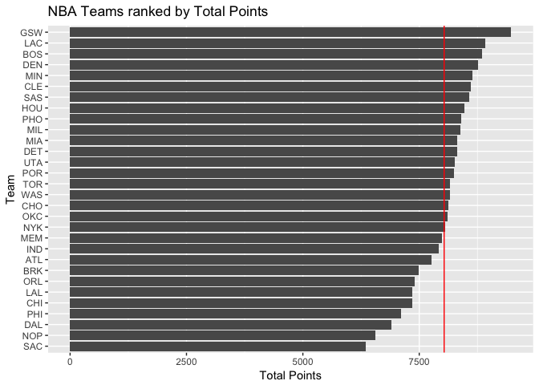

HW03 - Ranking NBA Teams
================
Donggyun Kim
2017-10-07

``` r
setwd("~/Desktop/STAT 133/stat133-hws-fall17/hw03/")
library(readr)
library(dplyr)
library(ggplot2)
teams<- read_csv("./data/nba2017_teams.csv")
```

Basic Rankings
==============

``` r
ggplot(teams, aes(x = reorder(team, salary), y = salary)) +
  geom_bar(stat='identity') +
  coord_flip() +
  geom_hline(yintercept = mean(teams$salary), col = "Red") +
  labs(x = "Team", y = "Salary (in millions)", title = "NBA Teams ranked by Total Salary")
```


``` r
ggplot(teams, aes(x = reorder(team, points), y = points)) +
  geom_bar(stat='identity') +
  coord_flip() +
  geom_hline(yintercept = mean(teams$points), col = "Red") +
  labs(x = "Team", y = "Total Points", title = "NBA Teams ranked by Total Points")
```



``` r
ggplot(teams, aes(x = reorder(team, efficiency), y = efficiency)) +
  geom_bar(stat='identity') +
  coord_flip() +
  geom_hline(yintercept = mean(teams$efficiency), col = "Red") +
  labs(x = "Team", y = "Total Efficiency", title = "NBA Teams ranked by Total Efficiency")
```


