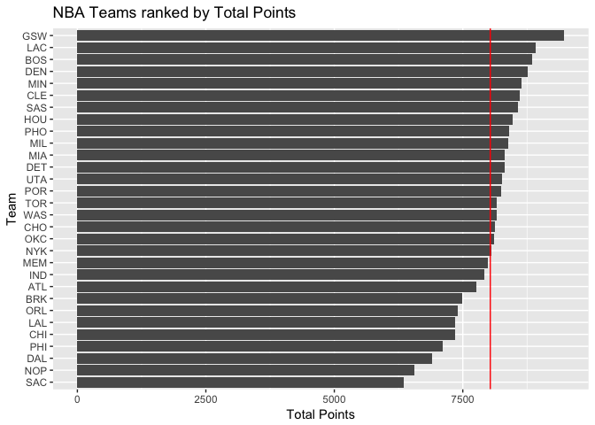
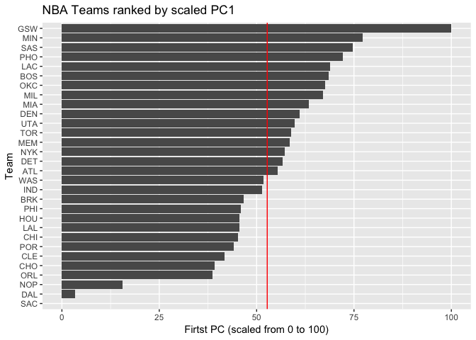

HW03 - Ranking NBA Teams
================
Donggyun Kim
2017-10-07

``` r
setwd("~/Desktop/STAT 133/stat133-hws-fall17/hw03/")
library(readr)
library(dplyr)
```

    ## Warning: package 'dplyr' was built under R version 3.4.2

``` r
library(ggplot2)
teams<- read_csv("./data/nba2017_teams.csv")
attributes(teams)$row.names <- teams$team
```

Basic Rankings
==============

``` r
ggplot(teams, aes(x = reorder(team, salary), y = salary)) +
  geom_bar(stat='identity') +
  coord_flip() +
  geom_hline(yintercept = mean(teams$salary), col = "Red") +
  labs(x = "Team", y = "Salary (in millions)", title = "NBA Teams ranked by Total Salary")
```


``` r
ggplot(teams, aes(x = reorder(team, points), y = points)) +
  geom_bar(stat='identity') +
  coord_flip() +
  geom_hline(yintercept = mean(teams$points), col = "Red") +
  labs(x = "Team", y = "Total Points", title = "NBA Teams ranked by Total Points")
```



``` r
ggplot(teams, aes(x = reorder(team, efficiency), y = efficiency)) +
  geom_bar(stat='identity') +
  coord_flip() +
  geom_hline(yintercept = mean(teams$efficiency), col = "Red") +
  labs(x = "Team", y = "Total Efficiency", title = "NBA Teams ranked by Total Efficiency")
```


Principal Components Analysis (PCA)
===================================

``` r
teams1 <- teams %>%
  select(points3, points2, free_throws, off_rebounds, def_rebounds, assists, steals,
         blocks, turnovers, fouls)

pca <- prcomp(teams1, scale. = TRUE)

eigs <- data.frame(
  eigenvalue = round(pca$sdev^2, 4),
  prop = round(pca$sdev^2 / sum(pca$sdev^2), 4)
)
eigs$cumprop <- cumsum(eigs$prop)
eigs
```

    ##    eigenvalue   prop cumprop
    ## 1      4.6959 0.4696  0.4696
    ## 2      1.7020 0.1702  0.6398
    ## 3      0.9795 0.0980  0.7378
    ## 4      0.7717 0.0772  0.8150
    ## 5      0.5341 0.0534  0.8684
    ## 6      0.4780 0.0478  0.9162
    ## 7      0.3822 0.0382  0.9544
    ## 8      0.2603 0.0260  0.9804
    ## 9      0.1336 0.0134  0.9938
    ## 10     0.0627 0.0063  1.0001

``` r
pci <- data.frame(pca$x)
ggplot(pci, aes(x = PC1, y = PC2)) + geom_text(label = rownames(pci))
```


``` r
z1 <- pci %>%
  select(PC1)
s1 <- (z1 - min(z1))/(max(z1) - min(z1))*100
s1$team <- attributes(s1)$row.names
ggplot(s1, aes(x = reorder(team, PC1), y = PC1)) +
  geom_bar(stat = "identity") +
  coord_flip() +
  geom_hline(yintercept = mean(s1$PC1), col = "red") +
  labs(x = "Team", y = "Firtst PC (scaled from 0 to 100)", title = "NBA Teams ranked by scaled PC1")
```


