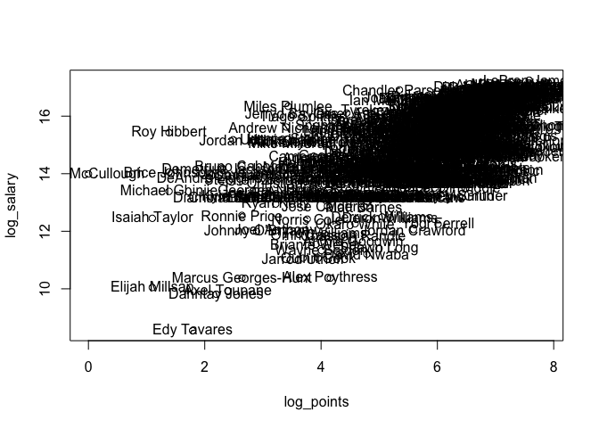

Untitled
================
Donggyun Kim
10/11/2017

Lab 02
------

Load the data file

``` r
load('nba2017-salary-points.RData')
```

Inspect the data objects

``` r
typeof(player)
```

    ## [1] "character"

``` r
mode(points)
```

    ## [1] "numeric"

``` r
class(position)
```

    ## [1] "character"

``` r
str(team)
```

    ##  Factor w/ 30 levels "ATL","BOS","BRK",..: 2 2 2 2 2 2 2 2 2 2 ...

``` r
object.size(salary)
```

    ## 3568 bytes

``` r
length(points3)
```

    ## [1] 441

``` r
head(points1)
```

    ## [1] 108  67  68   3  33 590

``` r
tail(points2)
```

    ## [1] 137 212   1 377 163 153

``` r
summary(team)
```

    ## ATL BOS BRK CHI CHO CLE DAL DEN DET GSW HOU IND LAC LAL MEM MIA MIL MIN 
    ##  14  15  15  15  15  15  15  15  15  15  14  14  15  15  15  14  14  14 
    ## NOP NYK OKC ORL PHI PHO POR SAC SAS TOR UTA WAS 
    ##  14  15  15  15  15  15  14  15  15  15  15  14

Vectors in R

``` r
is.vector(player)
```

    ## [1] TRUE

``` r
is.vector(team)
```

    ## [1] FALSE

``` r
is.atomic(player)
```

    ## [1] TRUE

``` r
is.atomic(team)
```

    ## [1] TRUE

``` r
is.factor(team)
```

    ## [1] TRUE

``` r
is.factor(player)
```

    ## [1] FALSE

Manipulate vectors

``` r
four <- player[1:4]
four
```

    ## [1] "Al Horford"        "Amir Johnson"      "Avery Bradley"    
    ## [4] "Demetrius Jackson"

``` r
four[0]
```

    ## character(0)

``` r
four[-1]
```

    ## [1] "Amir Johnson"      "Avery Bradley"     "Demetrius Jackson"

``` r
four[c(-1,-2,-3)]
```

    ## [1] "Demetrius Jackson"

``` r
four[5]
```

    ## [1] NA

``` r
four[c(1,2,2,3,3,3)]
```

    ## [1] "Al Horford"    "Amir Johnson"  "Amir Johnson"  "Avery Bradley"
    ## [5] "Avery Bradley" "Avery Bradley"

``` r
player[seq(2, length(player), 2)] # Even elements in `player`
```

    ##   [1] "Amir Johnson"            "Demetrius Jackson"      
    ##   [3] "Isaiah Thomas"           "James Young"            
    ##   [5] "Jonas Jerebko"           "Kelly Olynyk"           
    ##   [7] "Terry Rozier"            "Channing Frye"          
    ##   [9] "Deron Williams"          "Edy Tavares"            
    ##  [11] "J.R. Smith"              "Kay Felder"             
    ##  [13] "Kyle Korver"             "LeBron James"           
    ##  [15] "Tristan Thompson"        "Cory Joseph"            
    ##  [17] "DeMar DeRozan"           "Fred VanVleet"          
    ##  [19] "Jonas Valanciunas"       "Lucas Nogueira"         
    ##  [21] "P.J. Tucker"             "Patrick Patterson"      
    ##  [23] "Bojan Bogdanovic"        "Brandon Jennings"       
    ##  [25] "Daniel Ochefu"           "Jason Smith"            
    ##  [27] "Marcin Gortat"           "Otto Porter"            
    ##  [29] "Tomas Satoransky"        "DeAndre' Bembry"        
    ##  [31] "Dwight Howard"           "Jose Calderon"          
    ##  [33] "Kris Humphries"          "Mike Dunleavy"          
    ##  [35] "Paul Millsap"            "Thabo Sefolosha"        
    ##  [37] "Giannis Antetokounmpo"   "Jabari Parker"          
    ##  [39] "John Henson"             "Malcolm Brogdon"        
    ##  [41] "Michael Beasley"         "Rashad Vaughn"          
    ##  [43] "Thon Maker"              "Aaron Brooks"           
    ##  [45] "C.J. Miles"              "Jeff Teague"            
    ##  [47] "Kevin Seraphin"          "Lavoy Allen"            
    ##  [49] "Myles Turner"            "Rakeem Christmas"       
    ##  [51] "Anthony Morrow"          "Cameron Payne"          
    ##  [53] "Denzel Valentine"        "Isaiah Canaan"          
    ##  [55] "Jimmy Butler"            "Michael Carter-Williams"
    ##  [57] "Paul Zipser"             "Robin Lopez"            
    ##  [59] "Goran Dragic"            "James Johnson"          
    ##  [61] "Josh Richardson"         "Luke Babbitt"           
    ##  [63] "Rodney McGruder"         "Udonis Haslem"          
    ##  [65] "Willie Reed"             "Aron Baynes"            
    ##  [67] "Boban Marjanovic"        "Henry Ellenson"         
    ##  [69] "Jon Leuer"               "Marcus Morris"          
    ##  [71] "Reggie Bullock"          "Stanley Johnson"        
    ##  [73] "Brian Roberts"           "Christian Wood"         
    ##  [75] "Frank Kaminsky"          "Johnny O'Bryant"        
    ##  [77] "Marco Belinelli"         "Michael Kidd-Gilchrist" 
    ##  [79] "Nicolas Batum"           "Treveon Graham"         
    ##  [81] "Chasson Randle"          "Derrick Rose"           
    ##  [83] "Justin Holiday"          "Kyle O'Quinn"           
    ##  [85] "Marshall Plumlee"        "Mindaugas Kuzminskas"   
    ##  [87] "Sasha Vujacic"           "Aaron Gordon"           
    ##  [89] "C.J. Watson"             "Damjan Rudez"           
    ##  [91] "Evan Fournier"           "Jodie Meeks"            
    ##  [93] "Mario Hezonja"           "Patricio Garino"        
    ##  [95] "Terrence Ross"           "Dario Saric"            
    ##  [97] "Jahlil Okafor"           "Joel Embiid"            
    ##  [99] "Nik Stauskas"            "Robert Covington"       
    ## [101] "Shawn Long"              "Tiago Splitter"         
    ## [103] "Andrew Nicholson"        "Brook Lopez"            
    ## [105] "Isaiah Whitehead"        "Joe Harris"             
    ## [107] "K.J. McDaniels"          "Randy Foye"             
    ## [109] "Sean Kilpatrick"         "Trevor Booker"          
    ## [111] "Damian Jones"            "Draymond Green"         
    ## [113] "James Michael McAdoo"    "Kevin Durant"           
    ## [115] "Klay Thompson"           "Patrick McCaw"          
    ## [117] "Stephen Curry"           "Bryn Forbes"            
    ## [119] "David Lee"               "Dejounte Murray"        
    ## [121] "Joel Anthony"            "Kawhi Leonard"          
    ## [123] "LaMarcus Aldridge"       "Patty Mills"            
    ## [125] "Tony Parker"             "Chinanu Onuaku"         
    ## [127] "Eric Gordon"             "James Harden"           
    ## [129] "Lou Williams"            "Patrick Beverley"       
    ## [131] "Sam Dekker"              "Troy Williams"          
    ## [133] "Austin Rivers"           "Brandon Bass"           
    ## [135] "Chris Paul"              "Diamond Stone"          
    ## [137] "Jamal Crawford"          "Marreese Speights"      
    ## [139] "Raymond Felton"          "Alec Burks"             
    ## [141] "Dante Exum"              "George Hill"            
    ## [143] "Jeff Withey"             "Joe Johnson"            
    ## [145] "Raul Neto"               "Rudy Gobert"            
    ## [147] "Trey Lyles"              "Andre Roberson"         
    ## [149] "Doug McDermott"          "Jerami Grant"           
    ## [151] "Kyle Singler"            "Norris Cole"            
    ## [153] "Semaj Christon"          "Taj Gibson"             
    ## [155] "Andrew Harrison"         "Chandler Parsons"       
    ## [157] "James Ennis"             "Jarell Martin"          
    ## [159] "Mike Conley"             "Troy Daniels"           
    ## [161] "Wade Baldwin"            "Zach Randolph"          
    ## [163] "Allen Crabbe"            "Damian Lillard"         
    ## [165] "Evan Turner"             "Jusuf Nurkic"           
    ## [167] "Meyers Leonard"          "Pat Connaughton"        
    ## [169] "Tim Quarterman"          "Darrell Arthur"         
    ## [171] "Gary Harris"             "Jameer Nelson"          
    ## [173] "Kenneth Faried"          "Mason Plumlee"          
    ## [175] "Nikola Jokic"            "Will Barton"            
    ## [177] "Alexis Ajinca"           "Axel Toupane"           
    ## [179] "Dante Cunningham"        "Donatas Motiejunas"     
    ## [181] "Jordan Crawford"         "Omer Asik"              
    ## [183] "Solomon Hill"            "A.J. Hammons"           
    ## [185] "Devin Harris"            "Dorian Finney-Smith"    
    ## [187] "Harrison Barnes"         "Jarrod Uthoff"          
    ## [189] "Nicolas Brussino"        "Seth Curry"             
    ## [191] "Yogi Ferrell"            "Arron Afflalo"          
    ## [193] "Buddy Hield"             "Garrett Temple"         
    ## [195] "Kosta Koufos"            "Malachi Richardson"     
    ## [197] "Skal Labissiere"         "Tyreke Evans"           
    ## [199] "Adreian Payne"           "Brandon Rush"           
    ## [201] "Gorgui Dieng"            "Karl-Anthony Towns"     
    ## [203] "Nemanja Bjelica"         "Ricky Rubio"            
    ## [205] "Tyus Jones"              "Brandon Ingram"         
    ## [207] "D'Angelo Russell"        "Ivica Zubac"            
    ## [209] "Julius Randle"           "Luol Deng"              
    ## [211] "Nick Young"              "Thomas Robinson"        
    ## [213] "Tyler Ennis"             "Alex Len"               
    ## [215] "Derrick Jones"           "Dragan Bender"          
    ## [217] "Eric Bledsoe"            "Leandro Barbosa"        
    ## [219] "Ronnie Price"            "Tyler Ulis"

``` r
salary[seq(1, length(salary), 2)] # Odd elements in `salary`
```

    ##   [1] 26540100  8269663  1410598  6286408  4743000  1223653  3578880
    ##   [8]  8000000    18255   268029  9700000  1551659 21165675 17638063
    ##  [15]  2500000  1589640  1577280 14200000  2703960 12000000   874636
    ##  [22]  1196040 12250000 22116750  1191480 15944154 16957900  7400000
    ##  [29]   543471  3386598  2708582  8400000 15730338  2500000  1015696
    ##  [36]   418228  2281605 17100000  1551659 15200000  9607500 10500000
    ##  [43]  6348759  2368327 10230179   650000  1052342  4000000 10770000
    ##  [50] 18314532 14153652  1453680   874636 23200000  1643040  1709720
    ##  [57]  5782450 14000000  2898000 22116750  5782450  2593440   210995
    ##  [64]  5628000  6000000 22116750  1551659   874060  6000000  3678319
    ##  [71]   650000 14956522 17200000   102898  5318313  6511628 12000000
    ##  [78] 12250000 12500000  6000000 24559380 11242000 17000000  4317720
    ##  [85]  6191000   543471   543471  1375000 17000000  7250000  2613600
    ##  [92] 15000000    31969 11750000   950000    31969  9000000  9424084
    ##  [99]  1514160  1025831  8000000   874636  1326960   119494  1562280
    ## [106] 11483254  3000000  1790902  1395600   726672 11131368  1551659
    ## [113]  1015696  1403611  1182840   383351  5782450  2898000 10000000
    ## [120]   543471  2898000   874636  1192080 14000000 15500000   680534
    ## [127]  1296240   255000   543471  1000000 18735364  7806971  1315448
    ## [134] 20140838  1273920 21165675  7377500  2203000  3500000  5628000
    ## [141]  7000000 11050000 16073140  2250000   600000  1406520  2433334
    ## [148]  5994764  2440200 17145838  1191480  3750000 26540100  3140517
    ## [155]  6552960  5700000  1369229   980431 21165675  5505618  4264057
    ## [162]    83119  7680965  3219579  6666667   600000  8988764  2751360
    ## [169]  1350120 15050000  3241800  3210840  1987440  1627320  3500000
    ## [176]  5000000 11200000 22116750   543471 16957900  8081363 11286518
    ## [183]    63938  2090000  1015696 25000000  8375000  4096950  4384490
    ## [190]   874636 17100000  8000000  4008882  5229454  2202240  5200000
    ## [197] 13333333  1315448  3551160  6006600  7643979  3911380  3872520
    ## [204]   138414  3046299  2240880  7600000    73528 12500000  1207680
    ## [211]  1551659  6191000 16000000   874636 12606250  2223600    23069
    ## [218] 10470000  2941440  2128920 12415000

``` r
team[seq(5, length(team), 5)] # Multiples of 5
```

    ##  [1] BOS BOS BOS CLE CLE CLE TOR TOR TOR WAS WAS ATL ATL ATL MIL MIL MIL
    ## [18] IND IND IND CHI CHI CHI MIA MIA MIA DET DET DET CHO CHO CHO NYK NYK
    ## [35] NYK ORL ORL ORL PHI PHI PHI BRK BRK BRK GSW GSW GSW SAS SAS SAS HOU
    ## [52] HOU LAC LAC LAC UTA UTA UTA OKC OKC OKC MEM MEM MEM POR POR POR DEN
    ## [69] DEN DEN NOP NOP NOP DAL DAL DAL SAC SAC SAC MIN MIN MIN LAL LAL LAL
    ## [86] PHO PHO PHO
    ## 30 Levels: ATL BOS BRK CHI CHO CLE DAL DEN DET GSW HOU IND LAC LAL ... WAS

``` r
points[seq(10, length(points), 10)]
```

    ##  [1]  299    6  630  253   24  101 1246  767  815   59 1816  975  374 1105
    ## [15]  874   57   40   82  299  864  543  709 1742  130  638  639 1104  283
    ## [29]  100  421  425  551  586  262 1221  150  437  898  470  197  209  425
    ## [43]  168  444

``` r
team[seq(440, 2, -2)]
```

    ##   [1] PHO PHO PHO PHO PHO PHO PHO LAL LAL LAL LAL LAL LAL LAL LAL MIN MIN
    ##  [18] MIN MIN MIN MIN MIN SAC SAC SAC SAC SAC SAC SAC DAL DAL DAL DAL DAL
    ##  [35] DAL DAL DAL NOP NOP NOP NOP NOP NOP NOP DEN DEN DEN DEN DEN DEN DEN
    ##  [52] POR POR POR POR POR POR POR MEM MEM MEM MEM MEM MEM MEM MEM OKC OKC
    ##  [69] OKC OKC OKC OKC OKC UTA UTA UTA UTA UTA UTA UTA UTA LAC LAC LAC LAC
    ##  [86] LAC LAC LAC HOU HOU HOU HOU HOU HOU HOU SAS SAS SAS SAS SAS SAS SAS
    ## [103] SAS GSW GSW GSW GSW GSW GSW GSW BRK BRK BRK BRK BRK BRK BRK BRK PHI
    ## [120] PHI PHI PHI PHI PHI PHI ORL ORL ORL ORL ORL ORL ORL ORL NYK NYK NYK
    ## [137] NYK NYK NYK NYK CHO CHO CHO CHO CHO CHO CHO CHO DET DET DET DET DET
    ## [154] DET DET MIA MIA MIA MIA MIA MIA MIA CHI CHI CHI CHI CHI CHI CHI CHI
    ## [171] IND IND IND IND IND IND IND MIL MIL MIL MIL MIL MIL MIL ATL ATL ATL
    ## [188] ATL ATL ATL ATL WAS WAS WAS WAS WAS WAS WAS TOR TOR TOR TOR TOR TOR
    ## [205] TOR CLE CLE CLE CLE CLE CLE CLE CLE BOS BOS BOS BOS BOS BOS BOS
    ## 30 Levels: ATL BOS BRK CHI CHO CLE DAL DEN DET GSW HOU IND LAC LAL ... WAS

Sebsetting with logical vectors

``` r
player[which(team == "GSW" & position == "C")]
```

    ## [1] "Damian Jones"  "David West"    "JaVale McGee"  "Kevon Looney" 
    ## [5] "Zaza Pachulia"

``` r
player[which(team == "GSW" | team == "LAL")]
```

    ##  [1] "Andre Iguodala"       "Damian Jones"         "David West"          
    ##  [4] "Draymond Green"       "Ian Clark"            "James Michael McAdoo"
    ##  [7] "JaVale McGee"         "Kevin Durant"         "Kevon Looney"        
    ## [10] "Klay Thompson"        "Matt Barnes"          "Patrick McCaw"       
    ## [13] "Shaun Livingston"     "Stephen Curry"        "Zaza Pachulia"       
    ## [16] "Brandon Ingram"       "Corey Brewer"         "D'Angelo Russell"    
    ## [19] "David Nwaba"          "Ivica Zubac"          "Jordan Clarkson"     
    ## [22] "Julius Randle"        "Larry Nance Jr."      "Luol Deng"           
    ## [25] "Metta World Peace"    "Nick Young"           "Tarik Black"         
    ## [28] "Thomas Robinson"      "Timofey Mozgov"       "Tyler Ennis"

``` r
player[which(team == "LAL" & (position == "PG" | position == "SG"))]
```

    ## [1] "D'Angelo Russell" "David Nwaba"      "Jordan Clarkson" 
    ## [4] "Nick Young"       "Tyler Ennis"

Subsetting with character vectors

``` r
warriors_player <- player[team == "GSW"]
warriors_salary <- salary[team == "GSW"]
warriors_points <- points[team == "GSW"]
names(warriors_salary) <- warriors_player
warriors_salary["Andre Iguodala"]
```

    ## Andre Iguodala 
    ##       11131368

``` r
warriors_salary[c("Stephen Curry", "Kevin Durant")]
```

    ## Stephen Curry  Kevin Durant 
    ##      12112359      26540100

Some plotting

``` r
plot(points, salary)
```


``` r
log_points <- log(points)
log_salary <- log(salary)
plot(log_points, log_salary)
text(log_points, log_salary, labels = player)
```



``` r
plot(log_points, log_salary)
text(log_points, log_salary, labels = abbreviate(player))
```


Recycling

``` r
salary_millions <- salary/100000
```

Factors

``` r
is.factor(team)
```

    ## [1] TRUE

``` r
is.factor(position)
```

    ## [1] FALSE

``` r
position_fac <- factor(position)
table(position_fac)
```

    ## position_fac
    ##  C PF PG SF SG 
    ## 89 89 85 83 95

``` r
position_fac[1:5]
```

    ## [1] C  PF SG PG SF
    ## Levels: C PF PG SF SG

``` r
position_fac[team == "GSW"]
```

    ##  [1] SF C  C  PF SG PF C  SF C  SG SF SG PG PG C 
    ## Levels: C PF PG SF SG

``` r
position_fac[salary_millions > 15]
```

    ##   [1] C  PF SG PG SF SG SF PF C  SG PG C  C  SG SG SF PF SG PG SF SF C  SF
    ##  [24] SG PG SG SF C  C  PG C  SF PF PF SF SG C  C  PG C  PF SF SG PG PG C 
    ##  [47] PF SF PF PG SF PF SF SG SF C  PF SG C  SF PG PF SG PF C  SG PG C  SF
    ##  [70] PG PF SG PF SG C  SF PF SG PG SG SG PG SF C  PG PF PG C  SG PG C  PF
    ##  [93] PF SF PG C  SG C  C  PG C  PF PG PF SG SF SF PG SF PF PF C  SG PG SG
    ## [116] PF SF C  SG PG SF SG PG C  PF C  PF SF SF C  PG PG PG SG PF SG SF C 
    ## [139] SF PF SG C  PG C  SF SG PG C  PF C  SF PG C  SF PF SG PF SF C  PF SF
    ## [162] SG PG PG C  SG PF C  SF PF SG PG C  PG SG PG SG SG PF SF SF SG PF PF
    ## [185] PG C  SG SG SF SF PG SF SG PF PG PF PG SF SF SF C  PG PF SG SF PF SF
    ## [208] C  SF PF PG C  PF SG PF SF SF C  PG SG SG SF PG PF SF SG SG PG PF SF
    ## [231] C  SF PF PF SF PF PG SG SG PG PF PF SG C  SF C  SG SF C  C  SF C  SG
    ## [254] PG C  SF PG PG PF C  PF PG C  PG SG PF SG SG SG PG SG C  C  PG SF SF
    ## [277] C  PF SF SG C  PF C  C  PG PF PG SF SG SF SF PG SG PF SF SF SG C  C 
    ## [300] PG C  SG SG PF PG PF SG PF SF C 
    ## Levels: C PF PG SF SG

``` r
table(position_fac[salary_millions > 15])
```

    ## 
    ##  C PF PG SF SG 
    ## 63 60 58 65 64

``` r
prop.table(table(team[position_fac == "SG"]))
```

    ## 
    ##        ATL        BOS        BRK        CHI        CHO        CLE 
    ## 0.01052632 0.03157895 0.04210526 0.04210526 0.04210526 0.03157895 
    ##        DAL        DEN        DET        GSW        HOU        IND 
    ## 0.02105263 0.04210526 0.03157895 0.03157895 0.03157895 0.02105263 
    ##        LAC        LAL        MEM        MIA        MIL        MIN 
    ## 0.03157895 0.03157895 0.03157895 0.04210526 0.04210526 0.02105263 
    ##        NOP        NYK        OKC        ORL        PHI        PHO 
    ## 0.02105263 0.04210526 0.02105263 0.04210526 0.02105263 0.04210526 
    ##        POR        SAC        SAS        TOR        UTA        WAS 
    ## 0.04210526 0.05263158 0.05263158 0.03157895 0.02105263 0.03157895

More plots

``` r
plot(points, salary, col = position_fac, cex = 1.5, pch = 21)
```


