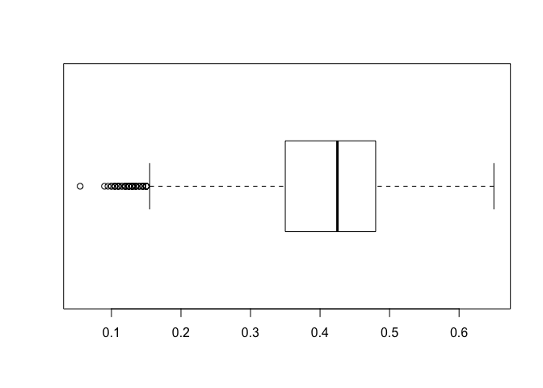

Lab 04
================
Donggyun Kim
10/12/2017

``` r
col_names <- c(
    'sex',
    'length',
    'diameter',
    'height',
    'whole_weight',
    'shucked_weight',
    'viscera_weight',
    'shell_weight',
    'rings')

col_types <- c(
    'factor',
    'numeric',
    'numeric',
    'numeric',
    'numeric',
    'numeric',
    'numeric',
    'numeric',
    'integer'   
)

abalone <- read.table(
  "abalone.data", 
  col.names = col_names, 
  colClasses = col_types, 
  sep = ","
)

str(abalone)
```

    ## 'data.frame':    4177 obs. of  9 variables:
    ##  $ sex           : Factor w/ 3 levels "F","I","M": 3 3 1 3 2 2 1 1 3 1 ...
    ##  $ length        : num  0.455 0.35 0.53 0.44 0.33 0.425 0.53 0.545 0.475 0.55 ...
    ##  $ diameter      : num  0.365 0.265 0.42 0.365 0.255 0.3 0.415 0.425 0.37 0.44 ...
    ##  $ height        : num  0.095 0.09 0.135 0.125 0.08 0.095 0.15 0.125 0.125 0.15 ...
    ##  $ whole_weight  : num  0.514 0.226 0.677 0.516 0.205 ...
    ##  $ shucked_weight: num  0.2245 0.0995 0.2565 0.2155 0.0895 ...
    ##  $ viscera_weight: num  0.101 0.0485 0.1415 0.114 0.0395 ...
    ##  $ shell_weight  : num  0.15 0.07 0.21 0.155 0.055 0.12 0.33 0.26 0.165 0.32 ...
    ##  $ rings         : int  15 7 9 10 7 8 20 16 9 19 ...

``` r
abalone <- read.csv(
  "abalone.data",
  col.names = col_names
)
str(abalone)
```

    ## 'data.frame':    4176 obs. of  9 variables:
    ##  $ sex           : Factor w/ 3 levels "F","I","M": 3 1 3 2 2 1 1 3 1 1 ...
    ##  $ length        : num  0.35 0.53 0.44 0.33 0.425 0.53 0.545 0.475 0.55 0.525 ...
    ##  $ diameter      : num  0.265 0.42 0.365 0.255 0.3 0.415 0.425 0.37 0.44 0.38 ...
    ##  $ height        : num  0.09 0.135 0.125 0.08 0.095 0.15 0.125 0.125 0.15 0.14 ...
    ##  $ whole_weight  : num  0.226 0.677 0.516 0.205 0.351 ...
    ##  $ shucked_weight: num  0.0995 0.2565 0.2155 0.0895 0.141 ...
    ##  $ viscera_weight: num  0.0485 0.1415 0.114 0.0395 0.0775 ...
    ##  $ shell_weight  : num  0.07 0.21 0.155 0.055 0.12 0.33 0.26 0.165 0.32 0.21 ...
    ##  $ rings         : int  7 9 10 7 8 20 16 9 19 14 ...

``` r
summary(abalone)
```

    ##  sex          length         diameter          height      
    ##  F:1307   Min.   :0.075   Min.   :0.0550   Min.   :0.0000  
    ##  I:1342   1st Qu.:0.450   1st Qu.:0.3500   1st Qu.:0.1150  
    ##  M:1527   Median :0.545   Median :0.4250   Median :0.1400  
    ##           Mean   :0.524   Mean   :0.4079   Mean   :0.1395  
    ##           3rd Qu.:0.615   3rd Qu.:0.4800   3rd Qu.:0.1650  
    ##           Max.   :0.815   Max.   :0.6500   Max.   :1.1300  
    ##   whole_weight    shucked_weight   viscera_weight     shell_weight   
    ##  Min.   :0.0020   Min.   :0.0010   Min.   :0.00050   Min.   :0.0015  
    ##  1st Qu.:0.4415   1st Qu.:0.1860   1st Qu.:0.09337   1st Qu.:0.1300  
    ##  Median :0.7997   Median :0.3360   Median :0.17100   Median :0.2340  
    ##  Mean   :0.8288   Mean   :0.3594   Mean   :0.18061   Mean   :0.2389  
    ##  3rd Qu.:1.1533   3rd Qu.:0.5020   3rd Qu.:0.25300   3rd Qu.:0.3290  
    ##  Max.   :2.8255   Max.   :1.4880   Max.   :0.76000   Max.   :1.0050  
    ##      rings       
    ##  Min.   : 1.000  
    ##  1st Qu.: 8.000  
    ##  Median : 9.000  
    ##  Mean   : 9.932  
    ##  3rd Qu.:11.000  
    ##  Max.   :29.000

Plots

``` r
plot(abalone$sex)
table_sex <- table(abalone$sex)
barplot(table_sex)
```


``` r
hist(abalone$diameter)
```


``` r
boxplot(abalone$diameter, horizontal = TRUE)
```



Pittsburgh Bridges Data Set

``` r
url <- "http://archive.ics.uci.edu/ml/machine-learning-databases/bridges/bridges.data.version1"
dest <- "bridges.data"
download.file(url, dest)
bridges <- read.table(dest)
bridges <- read.csv(dest)
str(bridges)
```

    ## 'data.frame':    107 obs. of  13 variables:
    ##  $ E1     : Factor w/ 107 levels "E10","E100","E101",..: 20 31 53 64 75 86 97 1 11 12 ...
    ##  $ M      : Factor w/ 4 levels "A","M","O","Y": 1 1 1 2 1 1 2 1 1 1 ...
    ##  $ X3     : Factor w/ 55 levels "?","1","10","11",..: 19 35 23 17 21 22 24 35 23 35 ...
    ##  $ X1818  : int  1819 1829 1837 1838 1840 1844 1846 1848 1851 1853 ...
    ##  $ HIGHWAY: Factor w/ 4 levels "AQUEDUCT","HIGHWAY",..: 2 1 2 2 2 1 2 1 2 3 ...
    ##  $ X.     : Factor w/ 65 levels "?","1000","1030",..: 5 1 2 1 65 2 24 1 2 1 ...
    ##  $ X2     : Factor w/ 5 levels "?","1","2","4",..: 3 2 3 3 3 2 3 2 3 3 ...
    ##  $ N      : Factor w/ 3 levels "?","G","N": 3 3 3 3 3 3 3 3 3 3 ...
    ##  $ THROUGH: Factor w/ 3 levels "?","DECK","THROUGH": 3 3 3 3 3 3 3 2 3 2 ...
    ##  $ WOOD   : Factor w/ 4 levels "?","IRON","STEEL",..: 4 4 4 4 4 2 2 4 4 4 ...
    ##  $ SHORT  : Factor w/ 4 levels "?","LONG","MEDIUM",..: 4 1 4 1 3 4 4 1 3 1 ...
    ##  $ S      : Factor w/ 4 levels "?","F","S","S-F": 3 3 3 3 3 3 3 3 3 3 ...
    ##  $ WOOD.1 : Factor w/ 8 levels "?","ARCH","CANTILEV",..: 8 8 8 8 8 7 7 8 8 8 ...

``` r
summary(bridges)
```

    ##        E1      M            X3         X1818          HIGHWAY  
    ##  E10    :  1   A:49   28     : 5   Min.   :1819   AQUEDUCT: 4  
    ##  E100   :  1   M:40   39     : 5   1st Qu.:1884   HIGHWAY :70  
    ##  E101   :  1   O:15   25     : 4   Median :1903   RR      :32  
    ##  E102   :  1   Y: 3   27     : 4   Mean   :1906   WALK    : 1  
    ##  E103   :  1          29     : 4   3rd Qu.:1928                
    ##  E105   :  1          1      : 3   Max.   :1986                
    ##  (Other):101          (Other):82                               
    ##        X.     X2     N         THROUGH      WOOD       SHORT      S     
    ##  ?      :26   ?:16   ?: 2   ?      : 6   ?    : 2   ?     :16   ?  : 5  
    ##  1000   :10   1: 4   G:80   DECK   :15   IRON :11   LONG  :30   F  :58  
    ##  1200   : 5   2:60   N:25   THROUGH:86   STEEL:79   MEDIUM:53   S  :29  
    ##  1500   : 2   4:23                       WOOD :15   SHORT : 8   S-F:15  
    ##  2000   : 2   6: 4                                                      
    ##  2300   : 2                                                             
    ##  (Other):60                                                             
    ##       WOOD.1  
    ##  SIMPLE-T:44  
    ##  WOOD    :15  
    ##  ARCH    :13  
    ##  CANTILEV:11  
    ##  SUSPEN  :11  
    ##  CONT-T  :10  
    ##  (Other) : 3

``` r
head(bridges)
```

    ##   E1 M X3 X1818  HIGHWAY   X. X2 N THROUGH WOOD  SHORT S WOOD.1
    ## 1 E2 A 25  1819  HIGHWAY 1037  2 N THROUGH WOOD  SHORT S   WOOD
    ## 2 E3 A 39  1829 AQUEDUCT    ?  1 N THROUGH WOOD      ? S   WOOD
    ## 3 E5 A 29  1837  HIGHWAY 1000  2 N THROUGH WOOD  SHORT S   WOOD
    ## 4 E6 M 23  1838  HIGHWAY    ?  2 N THROUGH WOOD      ? S   WOOD
    ## 5 E7 A 27  1840  HIGHWAY  990  2 N THROUGH WOOD MEDIUM S   WOOD
    ## 6 E8 A 28  1844 AQUEDUCT 1000  1 N THROUGH IRON  SHORT S SUSPEN

``` r
tail(bridges)
```

    ##       E1 M X3 X1818 HIGHWAY   X. X2 N THROUGH  WOOD  SHORT S WOOD.1
    ## 102  E85 M  9  1962 HIGHWAY 2213  4 G    DECK STEEL   LONG F CONT-T
    ## 103  E84 A 24  1969 HIGHWAY  870  6 G THROUGH STEEL MEDIUM F   ARCH
    ## 104  E91 O 44  1975 HIGHWAY 3756  6 G THROUGH STEEL   LONG F   ARCH
    ## 105  E90 M  7  1978 HIGHWAY  950  6 G THROUGH STEEL   LONG F   ARCH
    ## 106 E100 O 43  1982 HIGHWAY    ?  ? G       ?     ?      ? F      ?
    ## 107 E109 A 28  1986 HIGHWAY    ?  ? G       ?     ?      ? F      ?

``` r
dim(bridges)
```

    ## [1] 107  13

``` r
names(bridges)
```

    ##  [1] "E1"      "M"       "X3"      "X1818"   "HIGHWAY" "X."      "X2"     
    ##  [8] "N"       "THROUGH" "WOOD"    "SHORT"   "S"       "WOOD.1"

``` r
colnames(bridges)
```

    ##  [1] "E1"      "M"       "X3"      "X1818"   "HIGHWAY" "X."      "X2"     
    ##  [8] "N"       "THROUGH" "WOOD"    "SHORT"   "S"       "WOOD.1"

``` r
row.names(bridges)
```

    ##   [1] "1"   "2"   "3"   "4"   "5"   "6"   "7"   "8"   "9"   "10"  "11" 
    ##  [12] "12"  "13"  "14"  "15"  "16"  "17"  "18"  "19"  "20"  "21"  "22" 
    ##  [23] "23"  "24"  "25"  "26"  "27"  "28"  "29"  "30"  "31"  "32"  "33" 
    ##  [34] "34"  "35"  "36"  "37"  "38"  "39"  "40"  "41"  "42"  "43"  "44" 
    ##  [45] "45"  "46"  "47"  "48"  "49"  "50"  "51"  "52"  "53"  "54"  "55" 
    ##  [56] "56"  "57"  "58"  "59"  "60"  "61"  "62"  "63"  "64"  "65"  "66" 
    ##  [67] "67"  "68"  "69"  "70"  "71"  "72"  "73"  "74"  "75"  "76"  "77" 
    ##  [78] "78"  "79"  "80"  "81"  "82"  "83"  "84"  "85"  "86"  "87"  "88" 
    ##  [89] "89"  "90"  "91"  "92"  "93"  "94"  "95"  "96"  "97"  "98"  "99" 
    ## [100] "100" "101" "102" "103" "104" "105" "106" "107"

``` r
nrow(bridges)
```

    ## [1] 107

``` r
ncol(bridges)
```

    ## [1] 13

Creating data frames

``` r
my_table <- data.frame(
  col1 = letters[1:5],
  col2 = seq(10, 50, 10),
  col3 = c(TRUE, TRUE, FALSE, TRUE, FALSE),
  stringsAsFactors = FALSE
)
str(my_table)
```

    ## 'data.frame':    5 obs. of  3 variables:
    ##  $ col1: chr  "a" "b" "c" "d" ...
    ##  $ col2: num  10 20 30 40 50
    ##  $ col3: logi  TRUE TRUE FALSE TRUE FALSE

Data frame of GSW

``` r
Player <- c("Thompson", "Curry", "Green", "Durant", "Pachulia")
Position <- c("SG", "PG", "PF", "SF", "C")
Salary <- c(16663575, 12112359, 15330435, 26540100, 2898000)
Points <- c(1742, 1999, 776, 1555, 426)
PPG <- c(22.3, 25.3, 10.2, 25.1, 6.1)
Rookie <- c(rep(FALSE, 5))
gsw <- data.frame(
  Player,
  Position,
  Salary,
  Points,
  PPG,
  Rookie,
  stringsAsFactors = FALSE
)
str(gsw)
```

    ## 'data.frame':    5 obs. of  6 variables:
    ##  $ Player  : chr  "Thompson" "Curry" "Green" "Durant" ...
    ##  $ Position: chr  "SG" "PG" "PF" "SF" ...
    ##  $ Salary  : num  16663575 12112359 15330435 26540100 2898000
    ##  $ Points  : num  1742 1999 776 1555 426
    ##  $ PPG     : num  22.3 25.3 10.2 25.1 6.1
    ##  $ Rookie  : logi  FALSE FALSE FALSE FALSE FALSE

``` r
gsw$Position <- as.factor(gsw$Position)
gsw$Points <- as.integer(gsw$Points)
str(gsw)
```

    ## 'data.frame':    5 obs. of  6 variables:
    ##  $ Player  : chr  "Thompson" "Curry" "Green" "Durant" ...
    ##  $ Position: Factor w/ 5 levels "C","PF","PG",..: 5 3 2 4 1
    ##  $ Salary  : num  16663575 12112359 15330435 26540100 2898000
    ##  $ Points  : int  1742 1999 776 1555 426
    ##  $ PPG     : num  22.3 25.3 10.2 25.1 6.1
    ##  $ Rookie  : logi  FALSE FALSE FALSE FALSE FALSE

``` r
gsw2 <- cbind(Player, Position, Salary, Points, PPG, Rookie)
gsw2 <- data.frame(gsw2, stringsAsFactors = FALSE)
str(gsw2)
```

    ## 'data.frame':    5 obs. of  6 variables:
    ##  $ Player  : chr  "Thompson" "Curry" "Green" "Durant" ...
    ##  $ Position: chr  "SG" "PG" "PF" "SF" ...
    ##  $ Salary  : chr  "16663575" "12112359" "15330435" "26540100" ...
    ##  $ Points  : chr  "1742" "1999" "776" "1555" ...
    ##  $ PPG     : chr  "22.3" "25.3" "10.2" "25.1" ...
    ##  $ Rookie  : chr  "FALSE" "FALSE" "FALSE" "FALSE" ...

Adding column

``` r
gsw$new_column <- c(1,2,3,4,5)
gsw
```

    ##     Player Position   Salary Points  PPG Rookie new_column
    ## 1 Thompson       SG 16663575   1742 22.3  FALSE          1
    ## 2    Curry       PG 12112359   1999 25.3  FALSE          2
    ## 3    Green       PF 15330435    776 10.2  FALSE          3
    ## 4   Durant       SF 26540100   1555 25.1  FALSE          4
    ## 5 Pachulia        C  2898000    426  6.1  FALSE          5

``` r
weight <- c(215, 190, 230, 240, 270)
gsw <- cbind(gsw, weight)
```

Deleting column

``` r
gsw$new_column <- NULL
gsw
```

    ##     Player Position   Salary Points  PPG Rookie weight
    ## 1 Thompson       SG 16663575   1742 22.3  FALSE    215
    ## 2    Curry       PG 12112359   1999 25.3  FALSE    190
    ## 3    Green       PF 15330435    776 10.2  FALSE    230
    ## 4   Durant       SF 26540100   1555 25.1  FALSE    240
    ## 5 Pachulia        C  2898000    426  6.1  FALSE    270

Renaming columns

``` r
attributes(gsw)$names <- c("player", "position", "salary", "points", "ppg", "rooky", "weight")
gsw
```

    ##     player position   salary points  ppg rooky weight
    ## 1 Thompson       SG 16663575   1742 22.3 FALSE    215
    ## 2    Curry       PG 12112359   1999 25.3 FALSE    190
    ## 3    Green       PF 15330435    776 10.2 FALSE    230
    ## 4   Durant       SF 26540100   1555 25.1 FALSE    240
    ## 5 Pachulia        C  2898000    426  6.1 FALSE    270

Moving columns

``` r
reorder_names <- c("player", "weight", "position", "points", "ppg", "salary", "rooky")
gsw <- gsw[, reorder_names]
gsw
```

    ##     player weight position points  ppg   salary rooky
    ## 1 Thompson    215       SG   1742 22.3 16663575 FALSE
    ## 2    Curry    190       PG   1999 25.3 12112359 FALSE
    ## 3    Green    230       PF    776 10.2 15330435 FALSE
    ## 4   Durant    240       SF   1555 25.1 26540100 FALSE
    ## 5 Pachulia    270        C    426  6.1  2898000 FALSE

Transforming columns

``` r
gsw$salary <- gsw$salary/1000000
gsw
```

    ##     player weight position points  ppg   salary rooky
    ## 1 Thompson    215       SG   1742 22.3 16.66358 FALSE
    ## 2    Curry    190       PG   1999 25.3 12.11236 FALSE
    ## 3    Green    230       PF    776 10.2 15.33043 FALSE
    ## 4   Durant    240       SF   1555 25.1 26.54010 FALSE
    ## 5 Pachulia    270        C    426  6.1  2.89800 FALSE
