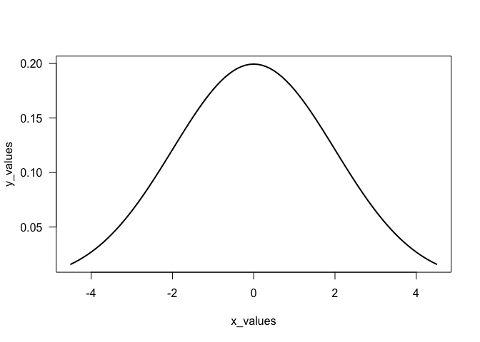
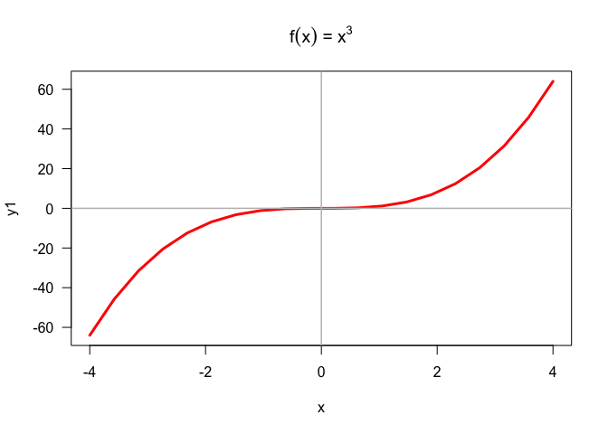
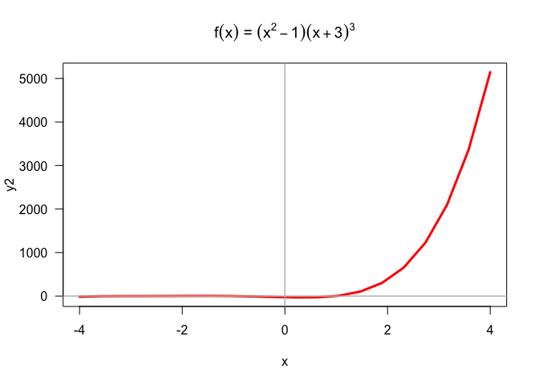
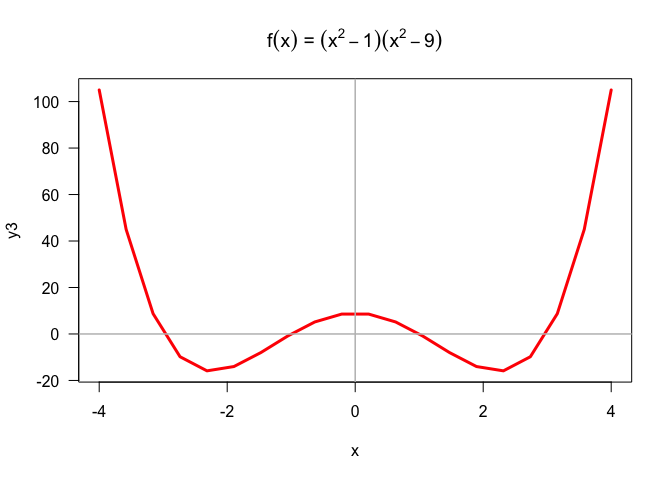

Untitled
================
Donggyun Kim
10/12/2017

Lab 7: Simple Functions and Conditionals
----------------------------------------

Simple math functions

``` r
f <- function(x){
  x*x
}
g <- function(x){
  2*x + 5
}
```

Test functions

``` r
f(2)
```

    ## [1] 4

``` r
f(-5)
```

    ## [1] 25

``` r
g(0)
```

    ## [1] 5

``` r
g(-5/2)
```

    ## [1] 0

Composite functions

``` r
fog <- function(x){
  f(g(x))
}
gof <- function(x){
  g(f(x))
}
```

Test functions

``` r
fog(2)
```

    ## [1] 81

``` r
fog(-5)
```

    ## [1] 25

``` r
gof(0)
```

    ## [1] 5

``` r
gof(-5/2)
```

    ## [1] 17.5

Pythagoras

``` r
pythagoras <- function(a, b){
  sqrt(a^2 + b^2)
}
```

Test

``` r
pythagoras(3, 4)
```

    ## [1] 5

Modify the function

``` r
pythagoras <- function(a, b = a){
  sqrt(a^2 + b^2)
}
```

Test

``` r
pythagoras(5)
```

    ## [1] 7.071068

Unit conversion formulas

``` r
miles2kms <- function(x){
  1.6*x
}
```

Table for miles and kms

``` r
miles <- c(seq(1, 10, 1), seq(10, 100, 10))
mydat <- data.frame(list(
  miles = miles
))
mydat$kms <- miles2kms(miles)
mydat
```

    ##    miles   kms
    ## 1      1   1.6
    ## 2      2   3.2
    ## 3      3   4.8
    ## 4      4   6.4
    ## 5      5   8.0
    ## 6      6   9.6
    ## 7      7  11.2
    ## 8      8  12.8
    ## 9      9  14.4
    ## 10    10  16.0
    ## 11    10  16.0
    ## 12    20  32.0
    ## 13    30  48.0
    ## 14    40  64.0
    ## 15    50  80.0
    ## 16    60  96.0
    ## 17    70 112.0
    ## 18    80 128.0
    ## 19    90 144.0
    ## 20   100 160.0

Gallons to liters

``` r
gallon2liters <- function(x){
  3.78541*x
}
liters2gallon <- function(x){
  x*x/gallon2liters(x)
}
```

Table for liters and gallons

``` r
liters <- c(seq(1, 10, 1), seq(10, 100, 10))
gallons <- liters2gallon(liters)
mydat2 <- data.frame(list(
  liters = liters, 
  gallons = gallons  
))
mydat2
```

    ##    liters    gallons
    ## 1       1  0.2641722
    ## 2       2  0.5283444
    ## 3       3  0.7925165
    ## 4       4  1.0566887
    ## 5       5  1.3208609
    ## 6       6  1.5850331
    ## 7       7  1.8492052
    ## 8       8  2.1133774
    ## 9       9  2.3775496
    ## 10     10  2.6417218
    ## 11     10  2.6417218
    ## 12     20  5.2834435
    ## 13     30  7.9251653
    ## 14     40 10.5668871
    ## 15     50 13.2086088
    ## 16     60 15.8503306
    ## 17     70 18.4920524
    ## 18     80 21.1337741
    ## 19     90 23.7754959
    ## 20    100 26.4172177

Seconds to years

``` r
seconds2years <- function(x){
  x/60/60/24/365
}
seconds2years(10^9)
```

    ## [1] 31.70979

Gaussian function

``` r
gaussian <- function(x, m, s){
  exp(-((x - m)/s)^2/2)/(s*sqrt(2*pi))
}
gaussian(1, 0, 2)
```

    ## [1] 0.1760327

``` r
dnorm(1, 0, 2)
```

    ## [1] 0.1760327

Plot Gaussian function

``` r
x_values <- seq(-4.5, 4.5, 0.1)
y_values <- gaussian(x_values, 0, 2)
plot(x_values, y_values, las = 1, type = "l", lwd = 2)
```



Polynomial function

``` r
poly1 <- function(x){
  x^3
}
poly2 <- function(x){
  (x^2-1)*(x+3)^3
}
poly3 <- function(x){
  (x^2-1)*(x^2-9)
}
```

Plot polynomial

``` r
x <- seq(-4, 4, length.out = 20)
y1 <- poly1(x)
y2 <- poly2(x)
y3 <- poly3(x)

plot(x, y1, type = 'l', lwd = 3, col = "red", las = 1)
abline(h = 0, v = 0, col = "gray", lwd = 1.5)
title(main = expression(paste(f(x), ' = ', x^3)))
```



``` r
plot(x, y2, type = "l", lwd = 3, col = "red", las = 1, 
     main = expression(paste(f(x), " = ", (x^2 - 1), (x + 3)^3)))
abline(h = 0, v = 0, col = "gray", lwd = 1.5)
```



``` r
plot(x, y3, type = "l", lwd = 3, col = "red", las = 1)
abline(h = 0, v = 0, col = "gray", lwd = 1.5)
title(main = expression(paste(f(x), " = ", (x^2 - 1), (x^2 - 9))))
```



Descriptive statistics

``` r
descriptive <- function(x){
  sm <- summary(x)
  min <- sm[1]
  q1 <- sm[2]
  median <- sm[3]
  mean <- sm[4]
  q3 <- sm[5]
  max <- sm[6]
  range <- max - min
  iqr = IQR(x)
  sd = sd(x)
}
```

Binomial function

``` r
combinations <- function(n, k){
  factorial(n)/factorial(k)/factorial(n-k)
}
combinations(n = 5, k = 2)
```

    ## [1] 10

``` r
binom_prob <- function(n, k, prob){
  combinations(n, k)*prob^k*(1 - prob)^(n - k)
}
binom_prob(n = 5, k = 2, prob = 0.5)
```

    ## [1] 0.3125

Use binom\_prob() to obtain the probability of getting more than 3 heads
in 5 tosses with a biased coin of 35% chance of heads.

``` r
myprob <- binom_prob(n = 5, k = 3:5, prob = 0.35)
sum(myprob)
```

    ## [1] 0.2351694

Consider rolling a fair die 10 times.
Use binom\_prob() to find the probability of getting exactly 3 sixes?

``` r
myprob2 <- binom_prob(n = 10, k = 3, prob = 1/6)
myprob2
```

    ## [1] 0.1550454

If conditionals

``` r
z <- 100*pi
if (z > 100){
  z <- 100
} else if (z < 0){
  z <- 0
} else {
  z
}
```

Even number

``` r
is_even <- function(x) {
  if ((x %% 2) == 0) {
    TRUE
  } else if ((x %% 2) == 1) {
    FALSE
  } else {
    NA
  }
}
is_even(10)
```

    ## [1] TRUE

``` r
is_even(33)
```

    ## [1] FALSE

Odd number

``` r
is_odd <- function(x){
  if (is_even(x) == FALSE ) {
    TRUE
  } else if (is_even(x) == TRUE) {
    FALSE
  } else {
    NA
  }
}
is_odd(1)
```

    ## [1] TRUE

``` r
is_odd(4)
```

    ## [1] FALSE

Switch

``` r
grade <- function(score){
  if (score <= 100 & score >= 90) {
    "A"
  } else if (score < 90 & score >= 80) {
    "B"
  } else if (score < 80 & score >= 70) {
    "C"
  } else if (score < 70 & score >= 60) {
    "D"
  } else if (score < 60) {
    "F"
  } else {
    stop("score must be a number between 0 and 100")
  }
}
grade(score = 90)
```

    ## [1] "A"

``` r
grade(score = 89.9999)
```

    ## [1] "B"

``` r
grade(score = 70.0000001)
```

    ## [1] "C"

``` r
grade(score = 50)
```

    ## [1] "F"

Switch function

``` r
miles2inches <- function(x = 1) {
  63360*x
}
miles2feet <- function(x = 1) {
  5280*x
}
miles2yards <- function(x = 1) {
  1760*x
}
miles2meters <- function(x = 1) {
  0.00062137*x
}
miles2kms <- function(x = 1) {
  0.62137*x
}
miles2inches(2)
```

    ## [1] 126720

``` r
miles2feet(2)
```

    ## [1] 10560

``` r
miles2yards(2)
```

    ## [1] 3520

``` r
miles2meters(2)
```

    ## [1] 0.00124274

``` r
miles2kms(2)
```

    ## [1] 1.24274

Using switch()

``` r
convert <- function(x, to = "km") {
  switch(to,
         "in" = miles2inches(x),
         "ft" = miles2feet(x),
         "yd" = miles2yards(x),
         "m" = miles2meters(x),
         "km" = miles2kms(x))
}
convert(3, "in")
```

    ## [1] 190080

``` r
convert(3, "ft")
```

    ## [1] 15840

``` r
convert(3, "yd")
```

    ## [1] 5280

``` r
convert(3, "m")
```

    ## [1] 0.00186411

``` r
convert(3, "km")
```

    ## [1] 1.86411

``` r
convert(3)
```

    ## [1] 1.86411
