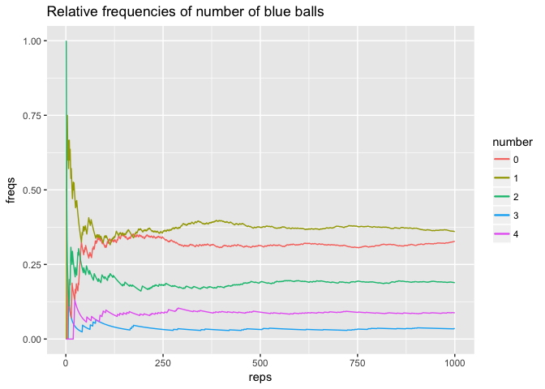

Lab09
================
Donggyun Kim
11/23/2017

Create two character vectors box1 and box2 with colors of balls

``` r
box1 <- c(rep("blue", 2), "red")
box2 <- c(rep("blue", 2), rep("red", 3), "white")
```

The random experiment involves generating a uniform random number using runif(1).
If this number is greater than 0.5, get a sample() without replacement of size = 4 from box1.
Otherwise, get a sample() without replacement of size = 4 from box2.

``` r
prob_unif <- runif(1)
if (prob_unif > 0.5) {
  sample(box1, size = 4, replace = TRUE)
} else {
  sample( box2, size = 4, replace = FALSE)
}
```

    ## [1] "blue" "red"  "red"  "red"

Repeat the experiment 1000 times using a for loop.
To store the drawn samples, use a matrix drawn\_balls.
This matrix will have 1000 rows and 4 columns.
In each row you assign the output of a random sample of balls.

``` r
num <- 1000
drawn_balls <- matrix(rep(0, num*4), nrow = 1000, ncol = 4)
sample <- character(4)
for (i in 1 : num) {
  if (runif(1) > 0.5) {
    sample <- sample(box1, size = 4, replace = TRUE)
  } else {
    sample <- sample(box2, size = 4, replace = FALSE)
  }
  drawn_balls[i,] <- sample
}
```

Once you filled the matrix drawn\_balls,
compute the proportion of samples containing: 0, 1, 2, 3, or 4 blue balls.

``` r
blue0 <- rep(0, num)
blue1 <- rep(0, num)
blue2 <- rep(0, num)
blue3 <- rep(0, num)
blue4 <- rep(0, num)
prop_blue0 <- rep(0, num)
prop_blue1 <- rep(0, num)
prop_blue2 <- rep(0, num)
prop_blue3 <- rep(0, num)
prop_blue4 <- rep(0, num)

for (i in 1 : num) {
  # plus one for counting blue0 in switch function
  sum <- sum(drawn_balls[i, ] == "blue") + 1 
  
  switch(sum,
         blue0[i] <- 1,
         blue1[i] <- 1,
         blue2[i] <- 1,
         blue3[i] <- 1,
         blue4[i] <- 1
         )
  prop_blue0[i] <- sum(blue0) / i
  prop_blue1[i] <- sum(blue1) / i
  prop_blue2[i] <- sum(blue2) / i
  prop_blue3[i] <- sum(blue3) / i
  prop_blue4[i] <- sum(blue4) / i
}

data.frame(
  blue0 = prop_blue0[num],
  blue1 = prop_blue1[num],
  blue2 = prop_blue2[num],
  blue3 = prop_blue3[num],
  blue4 = prop_blue4[num]
)
```

    ##   blue0 blue1 blue2 blue3 blue4
    ## 1 0.035 0.327 0.361 0.189 0.088

Try to obtain the following plot showing the relative frequencies of number of blue balls over the series of repetitions.

``` r
library(ggplot2)

dat <- data.frame(
  reps = 1 : num,
  prop_blue0,
  prop_blue1,
  prop_blue2,
  prop_blue3,
  prop_blue4
)

ggplot(dat, aes(x = reps)) +
  ggtitle("Relative frequencies of number of blue balls") +
  ylab("freqs") +
  geom_line(aes(y = prop_blue0, col = "red")) +
  geom_line(aes(y = prop_blue1, col = "blue")) +
  geom_line(aes(y = prop_blue2, col = "green")) +
  geom_line(aes(y = prop_blue3, col = "purple")) +
  geom_line(aes(y = prop_blue4, col = "yellow")) +
  scale_color_discrete(name = "number", labels = c("0", "1", "2", "3", "4"))
```


