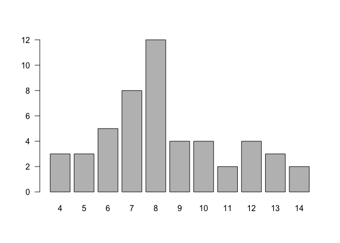
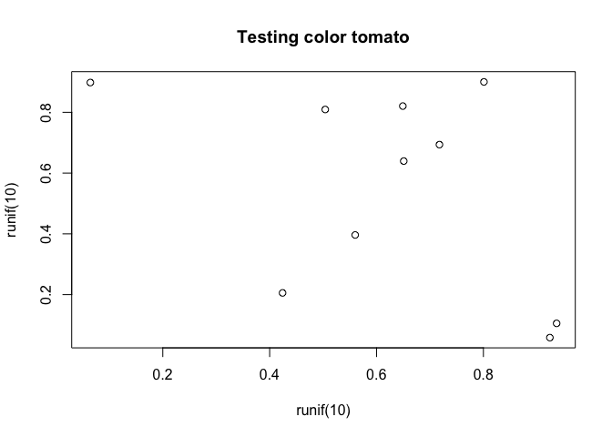

lab10-donggyun-kim
================
Donggyun Kim
11/23/2017

``` r
head(USArrests)
```

    ##            Murder Assault UrbanPop Rape
    ## Alabama      13.2     236       58 21.2
    ## Alaska       10.0     263       48 44.5
    ## Arizona       8.1     294       80 31.0
    ## Arkansas      8.8     190       50 19.5
    ## California    9.0     276       91 40.6
    ## Colorado      7.9     204       78 38.7

``` r
states <- rownames(USArrests)

nchar(states)
```

    ##  [1]  7  6  7  8 10  8 11  8  7  7  6  5  8  7  4  6  8  9  5  8 13  8  9
    ## [24] 11  8  7  8  6 13 10 10  8 14 12  4  8  6 12 12 14 12  9  5  4  7  8
    ## [47] 10 13  9  7

``` r
tolower(states)
```

    ##  [1] "alabama"        "alaska"         "arizona"        "arkansas"      
    ##  [5] "california"     "colorado"       "connecticut"    "delaware"      
    ##  [9] "florida"        "georgia"        "hawaii"         "idaho"         
    ## [13] "illinois"       "indiana"        "iowa"           "kansas"        
    ## [17] "kentucky"       "louisiana"      "maine"          "maryland"      
    ## [21] "massachusetts"  "michigan"       "minnesota"      "mississippi"   
    ## [25] "missouri"       "montana"        "nebraska"       "nevada"        
    ## [29] "new hampshire"  "new jersey"     "new mexico"     "new york"      
    ## [33] "north carolina" "north dakota"   "ohio"           "oklahoma"      
    ## [37] "oregon"         "pennsylvania"   "rhode island"   "south carolina"
    ## [41] "south dakota"   "tennessee"      "texas"          "utah"          
    ## [45] "vermont"        "virginia"       "washington"     "west virginia" 
    ## [49] "wisconsin"      "wyoming"

``` r
toupper(states)
```

    ##  [1] "ALABAMA"        "ALASKA"         "ARIZONA"        "ARKANSAS"      
    ##  [5] "CALIFORNIA"     "COLORADO"       "CONNECTICUT"    "DELAWARE"      
    ##  [9] "FLORIDA"        "GEORGIA"        "HAWAII"         "IDAHO"         
    ## [13] "ILLINOIS"       "INDIANA"        "IOWA"           "KANSAS"        
    ## [17] "KENTUCKY"       "LOUISIANA"      "MAINE"          "MARYLAND"      
    ## [21] "MASSACHUSETTS"  "MICHIGAN"       "MINNESOTA"      "MISSISSIPPI"   
    ## [25] "MISSOURI"       "MONTANA"        "NEBRASKA"       "NEVADA"        
    ## [29] "NEW HAMPSHIRE"  "NEW JERSEY"     "NEW MEXICO"     "NEW YORK"      
    ## [33] "NORTH CAROLINA" "NORTH DAKOTA"   "OHIO"           "OKLAHOMA"      
    ## [37] "OREGON"         "PENNSYLVANIA"   "RHODE ISLAND"   "SOUTH CAROLINA"
    ## [41] "SOUTH DAKOTA"   "TENNESSEE"      "TEXAS"          "UTAH"          
    ## [45] "VERMONT"        "VIRGINIA"       "WASHINGTON"     "WEST VIRGINIA" 
    ## [49] "WISCONSIN"      "WYOMING"

``` r
casefold(states, upper = TRUE)
```

    ##  [1] "ALABAMA"        "ALASKA"         "ARIZONA"        "ARKANSAS"      
    ##  [5] "CALIFORNIA"     "COLORADO"       "CONNECTICUT"    "DELAWARE"      
    ##  [9] "FLORIDA"        "GEORGIA"        "HAWAII"         "IDAHO"         
    ## [13] "ILLINOIS"       "INDIANA"        "IOWA"           "KANSAS"        
    ## [17] "KENTUCKY"       "LOUISIANA"      "MAINE"          "MARYLAND"      
    ## [21] "MASSACHUSETTS"  "MICHIGAN"       "MINNESOTA"      "MISSISSIPPI"   
    ## [25] "MISSOURI"       "MONTANA"        "NEBRASKA"       "NEVADA"        
    ## [29] "NEW HAMPSHIRE"  "NEW JERSEY"     "NEW MEXICO"     "NEW YORK"      
    ## [33] "NORTH CAROLINA" "NORTH DAKOTA"   "OHIO"           "OKLAHOMA"      
    ## [37] "OREGON"         "PENNSYLVANIA"   "RHODE ISLAND"   "SOUTH CAROLINA"
    ## [41] "SOUTH DAKOTA"   "TENNESSEE"      "TEXAS"          "UTAH"          
    ## [45] "VERMONT"        "VIRGINIA"       "WASHINGTON"     "WEST VIRGINIA" 
    ## [49] "WISCONSIN"      "WYOMING"

``` r
casefold(states, upper = FALSE)
```

    ##  [1] "alabama"        "alaska"         "arizona"        "arkansas"      
    ##  [5] "california"     "colorado"       "connecticut"    "delaware"      
    ##  [9] "florida"        "georgia"        "hawaii"         "idaho"         
    ## [13] "illinois"       "indiana"        "iowa"           "kansas"        
    ## [17] "kentucky"       "louisiana"      "maine"          "maryland"      
    ## [21] "massachusetts"  "michigan"       "minnesota"      "mississippi"   
    ## [25] "missouri"       "montana"        "nebraska"       "nevada"        
    ## [29] "new hampshire"  "new jersey"     "new mexico"     "new york"      
    ## [33] "north carolina" "north dakota"   "ohio"           "oklahoma"      
    ## [37] "oregon"         "pennsylvania"   "rhode island"   "south carolina"
    ## [41] "south dakota"   "tennessee"      "texas"          "utah"          
    ## [45] "vermont"        "virginia"       "washington"     "west virginia" 
    ## [49] "wisconsin"      "wyoming"

``` r
num_char <- nchar(states)
freq_char <- table(num_char)
barplot(freq_char, las = 1)
```



``` r
paste(head(states, 5), head(num_char, 5), sep = " = ")
```

    ## [1] "Alabama = 7"     "Alaska = 6"      "Arizona = 7"     "Arkansas = 8"   
    ## [5] "California = 10"

``` r
paste(head(states, 5), collapse = '')
```

    ## [1] "AlabamaAlaskaArizonaArkansasCalifornia"

``` r
substr(states, start = nchar(states) - 2, stop = nchar(states))
```

    ##  [1] "ama" "ska" "ona" "sas" "nia" "ado" "cut" "are" "ida" "gia" "aii"
    ## [12] "aho" "ois" "ana" "owa" "sas" "cky" "ana" "ine" "and" "tts" "gan"
    ## [23] "ota" "ppi" "uri" "ana" "ska" "ada" "ire" "sey" "ico" "ork" "ina"
    ## [34] "ota" "hio" "oma" "gon" "nia" "and" "ina" "ota" "see" "xas" "tah"
    ## [45] "ont" "nia" "ton" "nia" "sin" "ing"

``` r
paste0(substr(states, start = 1, stop = 1), substr(states, start = nchar(states) - 2, stop = nchar(states)))
```

    ##  [1] "Aama" "Aska" "Aona" "Asas" "Cnia" "Cado" "Ccut" "Dare" "Fida" "Ggia"
    ## [11] "Haii" "Iaho" "Iois" "Iana" "Iowa" "Ksas" "Kcky" "Lana" "Mine" "Mand"
    ## [21] "Mtts" "Mgan" "Mota" "Mppi" "Muri" "Mana" "Nska" "Nada" "Nire" "Nsey"
    ## [31] "Nico" "Nork" "Nina" "Nota" "Ohio" "Ooma" "Ogon" "Pnia" "Rand" "Sina"
    ## [41] "Sota" "Tsee" "Txas" "Utah" "Vont" "Vnia" "Wton" "Wnia" "Wsin" "Wing"

### Challenge

``` r
states_list <- list(0)

for (i in min(num_char) : max(num_char)) {
  if (i %% 2 == 0) {
    states_list[[i - min(num_char) + 1]] <- toupper(paste(states[num_char == i], collapse = ", "))
  } else {
    states_list[[i - min(num_char) + 1]] <- tolower(paste(states[num_char == i], collapse = ", "))
  }
}

names(states_list) <- paste0(min(num_char) : max(num_char), "-chars")

states_list
```

    ## $`4-chars`
    ## [1] "IOWA, OHIO, UTAH"
    ## 
    ## $`5-chars`
    ## [1] "idaho, maine, texas"
    ## 
    ## $`6-chars`
    ## [1] "ALASKA, HAWAII, KANSAS, NEVADA, OREGON"
    ## 
    ## $`7-chars`
    ## [1] "alabama, arizona, florida, georgia, indiana, montana, vermont, wyoming"
    ## 
    ## $`8-chars`
    ## [1] "ARKANSAS, COLORADO, DELAWARE, ILLINOIS, KENTUCKY, MARYLAND, MICHIGAN, MISSOURI, NEBRASKA, NEW YORK, OKLAHOMA, VIRGINIA"
    ## 
    ## $`9-chars`
    ## [1] "louisiana, minnesota, tennessee, wisconsin"
    ## 
    ## $`10-chars`
    ## [1] "CALIFORNIA, NEW JERSEY, NEW MEXICO, WASHINGTON"
    ## 
    ## $`11-chars`
    ## [1] "connecticut, mississippi"
    ## 
    ## $`12-chars`
    ## [1] "NORTH DAKOTA, PENNSYLVANIA, RHODE ISLAND, SOUTH DAKOTA"
    ## 
    ## $`13-chars`
    ## [1] "massachusetts, new hampshire, west virginia"
    ## 
    ## $`14-chars`
    ## [1] "NORTH CAROLINA, SOUTH CAROLINA"

### Converting from Fahrenheit Degrees

``` r
to_celsius <- function(x = 1) {
  (x - 32) * (5 / 9)
}

to_kelvin <- function(x = 1) {
  (x + 459.67) * (5 / 9)
}

to_reaumur <- function(x = 1) {
  (x - 32) * (4 / 9)
}

to_rankine <- function(x = 1) {
  x + 459.67
}

temp_convert <- function(x = 1, to = "celsius") {
  switch(tolower(to),
         "celsius" = to_celsius(x),
         "kelvin" = to_kelvin(x),
         "reaumur" = to_reaumur(x),
         "rankine" = to_rankine(x))
}

temp_convert(30, "celsius")
```

    ## [1] -1.111111

``` r
temp_convert(30, "Celsius")
```

    ## [1] -1.111111

``` r
temp_convert(30, "CELSIUS")
```

    ## [1] -1.111111

### Names of files

``` r
# first way
file <- rep("file", 10)
num <- 1:10
csv <- rep(".csv")
paste(file, num, csv, sep = "")
```

    ##  [1] "file1.csv"  "file2.csv"  "file3.csv"  "file4.csv"  "file5.csv" 
    ##  [6] "file6.csv"  "file7.csv"  "file8.csv"  "file9.csv"  "file10.csv"

``` r
# second way
paste("file", 1:10, ".csv", sep = "")
```

    ##  [1] "file1.csv"  "file2.csv"  "file3.csv"  "file4.csv"  "file5.csv" 
    ##  [6] "file6.csv"  "file7.csv"  "file8.csv"  "file9.csv"  "file10.csv"

``` r
# third way
paste0("file", 1:10, ".csv")
```

    ##  [1] "file1.csv"  "file2.csv"  "file3.csv"  "file4.csv"  "file5.csv" 
    ##  [6] "file6.csv"  "file7.csv"  "file8.csv"  "file9.csv"  "file10.csv"

``` r
# rename
rename <- paste0("file", 1:10, ".csv")
sub(pattern = "file", replacement = "dataset", rename)
```

    ##  [1] "dataset1.csv"  "dataset2.csv"  "dataset3.csv"  "dataset4.csv" 
    ##  [5] "dataset5.csv"  "dataset6.csv"  "dataset7.csv"  "dataset8.csv" 
    ##  [9] "dataset9.csv"  "dataset10.csv"

### Using function `cat()`

``` r
outfile <- "output.txt"

cat("---\n", file = outfile)
cat("title: \"lab10\"\n", file = outfile, append = TRUE)
cat("author: \"Donggyun Kim\"\n", file = outfile, append = TRUE)
cat("date: \"2017-11-23\"\n", file = outfile, append = TRUE)
cat("output: github_document\n", file = outfile, append = TRUE)
cat("---\n", file = outfile, append = TRUE)

cat("\nThis is the first line\n", file = outfile, append = TRUE)
cat("A 2nd line\n", file = "output.txt", append = TRUE)

cat("\nThe quick brown fox jumps over the lazy dog\n",
    file = outfile, append = TRUE)
```

### Valid Color Names

``` r
is_color <- function(x) {
  if (sum(colors() == x) > 0) {
    TRUE
  } else {
    FALSE
  }
}

is_color("yellow")  
```

    ## [1] TRUE

``` r
is_color("blu")     
```

    ## [1] FALSE

``` r
is_color("turkuoise")
```

    ## [1] FALSE

``` r
colplot <- function(col) {
  if (is_color(col)) {
    plot(runif(10), runif(10), main = paste("Testing color", col, sep = " "))
  } else {
    stop(paste("invalid color", col, sep = " "))
  }
}

colplot('tomato')
```



``` r
colplot('tomate')
```

    ## Error in colplot("tomate"): invalid color tomate

### Counting number of vowels

``` r
set.seed(1)
letrs <- sample(letters, size = 100, replace = TRUE)
head(letrs)
```

    ## [1] "g" "j" "o" "x" "f" "x"

``` r
count_vowel <- function(x) {
  a <- sum(x == "a")
  e <- sum(x == "e")
  i <- sum(x == "i")
  o <- sum(x == "o")
  u <- sum(x == "u")
  
  cat(paste0("a: ", a))
  cat(paste0("\ne: ", e))
  cat(paste0("\ni: ", i))
  cat(paste0("\no: ", o))
  cat(paste0("\nu: ", u))
}

count_vowel(letrs)
```

    ## a: 2
    ## e: 2
    ## i: 6
    ## o: 2
    ## u: 8

``` r
count_consonant <- function(letrs) {
  b <- sum(letrs == "b")
  c <- sum(letrs == "c")
  d <- sum(letrs == "d")
  f <- sum(letrs == "f")
  g <- sum(letrs == "g")
  h <- sum(letrs == "h")
  j <- sum(letrs == "j")
  k <- sum(letrs == "k")
  l <- sum(letrs == "l")
  m <- sum(letrs == "m")
  n <- sum(letrs == "n")
  p <- sum(letrs == "p")
  q <- sum(letrs == "q")
  r <- sum(letrs == "r")
  s <- sum(letrs == "s")
  t <- sum(letrs == "t")
  v <- sum(letrs == "v")
  w <- sum(letrs == "w")
  x <- sum(letrs == "x")
  y <- sum(letrs == "y")
  z <- sum(letrs == "z")
  
  vec <- c(b = b, c = c, d = d, f = f, g = g, h = h, j = j, k = k, l = l, m = m, 
           n = n, p = p, q = q, r = r, s = s, t = t, v = v, w = w, x = x, y = y,
           z = z)
  vec
}

count_consonant(letrs)
```

    ## b c d f g h j k l m n p q r s t v w x y z 
    ## 3 3 3 4 6 1 5 6 4 7 2 2 5 4 5 3 4 5 4 3 1

### Number of letters, vowels, and consonants

``` r
count_letters <- function(letrs) {
  cat(paste0("\"letters: ", length(letrs), "\"\n"))
  cat(paste0("\"vowels: ", length(letrs) - sum(count_consonant(letrs)), "\"\n"))
  cat(paste0("\"consonants: ", sum(count_consonant(letrs)), "\""))
}

count_letters(letrs)
```

    ## "letters: 100"
    ## "vowels: 20"
    ## "consonants: 80"
