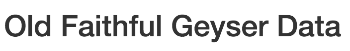

Post 01 - Reactivity in Shiny Apps
================
Donggyun Kim
10/30/2017

1. Introduction
===============

In recent classes and labs, we learned about what is a Shiny app and how to build it.
In order to build a Shiny app, we use almost same coding style we have been used
in Rmd or R script files. However, Shiny apps own a special structure that seems
somewhat different from Rmd or R script files although it is built by an R script
file. Moreover, Shiny apps possess a nice trait, **reactivity**, that reduces the
effort of rewriting code or changing initial value(*input*) to see different results
(*output*). In other words, this trait makes it possible to compare each result of
each initial value to others simultaneously, which also means it is interactive.
In this post, I want to talk about what **reactivity** is and how it works in Shiny apps.

2. Structure of Shiny Apps
==========================

To talk about **reactivity**, we first get familiar with the structure of Shiny apps.


When you create new Shiny app file in RStudio, you will see a basic example as a guideline
for building Shiny apps.

``` r
library(shiny)

# Define UI for application that draws a histogram
ui <- fluidPage(
   
   # Application title
   titlePanel("Old Faithful Geyser Data"),
   
   # Sidebar with a slider input for number of bins 
   sidebarLayout(
      sidebarPanel(
         sliderInput("bins",
                     "Number of bins:",
                     min = 1,
                     max = 50,
                     value = 30)
      ),
      
      # Show a plot of the generated distribution
      mainPanel(
         plotOutput("distPlot")
      )
   )
)

# Define server logic required to draw a histogram
server <- function(input, output) {
   
   output$distPlot <- renderPlot({
      # generate bins based on input$bins from ui.R
      x    <- faithful[, 2] 
      bins <- seq(min(x), max(x), length.out = input$bins + 1)
      
      # draw the histogram with the specified number of bins
      hist(x, breaks = bins, col = 'darkgray', border = 'white')
   })
}

# Run the application 
shinyApp(ui = ui, server = server)
```

This template shows that the app consists of **three components**.

`ui`: User Interface object that manages the appearance of the app
`server`: Function that contains instructions for computer to build the app
`shinyApp`: Function that executes the app

When you  in RStudio, you will see how the app looks as the below image.


Before moving on **reactivity**, let me talk briefly about two components:
`ui` and `server`.

1.  `ui` **User Interface**

``` r
ui <- fluidPage(
   
   # Application title
   titlePanel("Old Faithful Geyser Data"),
   
   # Sidebar with a slider input for number of bins 
   sidebarLayout(
      sidebarPanel(
         sliderInput("bins",
                     "Number of bins:",
                     min = 1,
                     max = 50,
                     value = 30)
      ),
      
      # Show a plot of the generated distribution
      mainPanel(
         plotOutput("distPlot")
      )
   )
)
```

This is a code structure of `ui`. It contains `titlePanel()` and `slidebarLayout()`.

-   `titlePanel()` represents the title of the app. In this example,
    

-   `slidebarLayout()` contains two functions, `sidebarPanel()` and `mainPanel()`.
    -   `sidebarPanel()` represents the initial value(*input*) of the app and takes the input
        from users. In this example,
        
    -   `mainPanel()` represents the result(*output*) of the app. In this example,
        

In the following sections, I will focus on `slidebarLayout()` to talk about **reactivity**.

1.  `server` **Function**

``` r
server <- function(input, output) {
   
   output$distPlot <- renderPlot({
      # generate bins based on input$bins from ui.R
      x    <- faithful[, 2] 
      bins <- seq(min(x), max(x), length.out = input$bins + 1)
      
      # draw the histogram with the specified number of bins
      hist(x, breaks = bins, col = 'darkgray', border = 'white')
   })
}
```

Server function contains two *arguments*: `input` and `output`. This is because
`server` function plays a central role in **reactivity**. When users set initial
or input value through `ui`, `server` function takes input value from `ui`,
executes code with input value, and sends output to `ui` so that users can see
the result.

You may notice that I repeated two words, *input* and *output*. You will see the
reason why I did so.

3. What is reactivity?
======================

It is easy to understand **reactivity** when you think about how functions work in R.

``` r
#create reactivity function
reactivity <- function(input) {
  output <- 2*input
  output
}

#users set initial value(input) 2
input <- 2

#reactivity function takes input value 2,
#execute code with the input,
#and print the result(output)

reactivity(input)
```

    ## [1] 4

The *output* of `reactivity` function depends on only *input* unless the function is
redefined. That is, *input* **interacts** with *output* through the `reactivity` function.

``` r
#set different input
input <- 3
reactivity(input)
```

    ## [1] 6

``` r
#set another different input
input <- 4
reactivity(input)
```

    ## [1] 8

Every time you set different input, `reactivity` function produces different output.

4. How does reactivity work in Shiny apps?
==========================================

``` r
# Sidebar with a slider input for number of bins 
   sidebarLayout(
      sidebarPanel(
         sliderInput("bins",              #inputId = "bins"
                     "Number of bins:",   
                     min = 1,
                     max = 50,
                     value = 30)
      )
```

In `ui` part, `sliderInput()` is in charge of taking input from users. It has `inputId`
argument, which corresponds to "bins" in this example. `server` function interacts this
`inputId` argument using "**input$**" operator.

``` r
output$distPlot <- renderPlot({
      # generate bins based on input$bins from ui.R
      x    <- faithful[, 2] 
      
      # input$ operator used to manage the length of bins
      bins <- seq(min(x), max(x), length.out = input$bins + 1) 
      
      # draw the histogram with the specified number of bins
      hist(x, breaks = bins, col = 'darkgray', border = 'white')
   })
```

That is, when users set the input value, `server` function executes code with input
value and produce the result. The result also will be connected with specified
`outputId`.

``` r
output$distPlot <- renderPlot({     #outputId = distPlot
  
  ...

  })
```

In this example, the outputId is "**distPlot**".

``` r
ui <- fluidPage(
  
  ...
  
   # Show a plot of the generated distribution
      mainPanel(
         plotOutput("distPlot")
      )
)
```

`ui` shows the result on the mainPanel calling `plotOutput`function with
"**distPlot**" argument.
If the user sets input value as 6,

the histogram shows the result with 6 bins.

If the user sets input value as 15,

the histogram shows the result with 15 bins.


5. Conclusion
=============

**Reactivity** in Shiny apps happens in a condition where *input* set by user
**interacts** simultaneously with *output*. Since both *input* and *output* are
displayed on `ui` as described above sections, users can easily check what is
happening on the app whenever they change the input value.

Although it seems quite simple and basic concept, I personally consider **reactivity**
as a main building block of Shiny apps. Also, I believe that if we fully understand
the concept of **reactivity**, it would be a great help for us to study more about
Shiny apps.

6. References
=============

[Reactivity - An overview](https://shiny.rstudio.com/articles/reactivity-overview.html) by RStudio
[How to understand reactivity in R](https://shiny.rstudio.com/articles/understanding-reactivity.html) by Garret Grolemund
[Shiny Tutorial - Structure of a Shiny App](https://bookdown.org/weicheng/shinyTutorial/structure-of-a-shiny-app.html) by Weicheng Zhu
[Shiny Tutorial - UI](https://bookdown.org/weicheng/shinyTutorial/ui.html) by Weicheng Zhu
[Shiny Tutorial - Server](https://bookdown.org/weicheng/shinyTutorial/server.html) by Weicheng Zhu
[R Shiny app tutorial \# 1 - How to make shiny apps - An introduction to Shiny](https://www.youtube.com/watch?v=_0ORRJqctHE&t=4s) by Abhinav Agrawal
[Rstudio Tutorial: developing a web application with Shiny package](https://www.youtube.com/watch?v=Gyrfsrd4zK0) by Ehsan Jahanpour
[Tutorial: creating webapps with R using Shiny](http://stcorp.nl/R_course/tutorial_shiny.html) by Paul Hiemstra
[Data Science Lab: R Shiny Application with Reactivity and Buttons](https://www.youtube.com/watch?v=63KnV4XWsR0) by John Muschelli
[R Shiny app tutorial \# 7 - how to plot using renderPlot() in shiny - Example of a reactive histogram](https://www.youtube.com/watch?v=z5bUzdIbIyg) by Abhinav Agrawal
[Building Shiny Apps](http://cfss.uchicago.edu/shiny001_abc.html)
[Shiny Cheat Sheet](http://shiny.rstudio.com/images/shiny-cheatsheet.pdf) by RStudio
