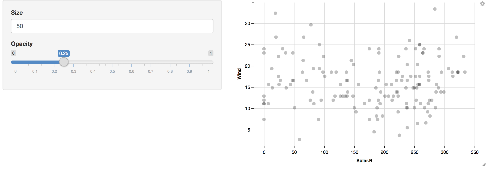

## 1. Introduction
From the last homework in the class, we learned how to make graphic plots using `ggvis` package. The visualization of ggvis seems apparently similar to that of `ggplot2` package. However, `ggvis` and `ggplot2` have different function interfaces as well as `ggvis` is restricted to basic functions of `ggplot2`. For example, `ggvis` uses `%>%` for the combine operator whereas `ggplot2` uses `+`. In addition, `ggvis` does not have faceting function `ggplot2` has but makes it possible to adjust a size of graphics, which `ggplot2` cannot. In this post, I will talk about processes of data visualization using these two packages and about differences between `ggvis` and `ggplot2`

## 2. Data Visualization with `ggvis` and `ggplot2`
### 1) Appearance
We first make two simple plots using two packages to see whether their plots looks different.
```{r, message = FALSE, echo = FALSE}
# load two packages
library(ggplot2)
library(ggvis)

# use an R built-in data set "airquality" and convert NA's to zero
dat <- airquality
dat[is.na(airquality)] <- 0

# make a plot using ggplot()
ggplot(data = dat, aes(x = Ozone, y = Temp)) +
  geom_point()

# make a plot using ggvis()
ggvis(data = dat, x = ~Ozone, y = ~Temp) %>%
  layer_points()
```
Although the appearances of two plots are similar to each other, the syntax of two functions is different.

### 2) Syntax
This is a code chunk of above two plots. The first plot is made by `ggplot2`, and the second plot by `ggvis`.
```{r, fig.show = "hide", results = "hide"}
# load two packages
library(ggplot2)
library(ggvis)

# use an R built-in data set "airquality" and convert NA's to zero
dat <- airquality
dat[is.na(airquality)] <- 0

# make the first plot using ggplot()
ggplot(data = dat, aes(x = Ozone, y = Temp)) +
  geom_point()

# make the second plot using ggvis()
ggvis(data = dat, x = ~Ozone, y = ~Temp) %>%
  layer_points()
```
`ggplot()` needs `+` operator to specify the type of graphic while `ggvis()` needs `%>%` operator. Moreover, `ggplot()` needs `aes()` to assign x and y variables of the plot but `ggvis()` needs `~`. For scatter plots, `ggplot()` uses `geom_point()` which is one in `geom_` group whereas `ggvis()` uses `layer_points()` that is one in `layer_` group.  
  
Another difference between `ggvis` and `ggplot2` is that `ggvis` has unlimited hierarchy while `ggplot2` has two level hierarchy: `data` and `aes()`. For example,
```{r}
# two hierarchy, data and aes() in ggplot() function
ggplot(data = dat, aes(x = Solar.R, y = Wind, col = Month)) +
  geom_point()

# unlimited hierarchy in ggvis() function
dat %>%
  ggvis(x = ~Solar.R, y = ~Wind, fill = ~Month) %>%
  layer_points()
```

### 3) Changes in Original Data Set
One of advantages of using `ggvis` against `ggplot2` is that since `ggvis` uses `%>%` operator also used in `dplyr` package, it is possible to put `ggvis` and  `dplyr` together.
```{r, message = FALSE, warning = FALSE}
# load dplyr package
library(dplyr)

# combine ggvis and dplyr to make a plot
dat %>%
  ggvis(x = ~Solar.R, y = ~Wind) %>%
  # convert mph to km/h using mutate() in dplyr
  mutate(Wind = Wind * 1.61) %>%
  layer_points()

# show whether the data is changed
head(dat %>% select(Solar.R, Wind), n = 5)
```
We can also make the same plot using `ggplot2` and `dplyr`. However,
```{r}
# convert mph to km/h
dat <- dat %>% mutate(Wind = Wind * 1.61)

# make a plot using ggplot()
ggplot(dat, aes(x = Solar.R, y = Wind)) +
  geom_point()

# show whether the data is changed
head(dat %>% select(Solar.R, Wind), n = 5)
```
we have to change values of original data set (values of `Wind` in above tables) when we want to use `ggplot2`. If we want to keep the original data set, we may want to use `ggvis`.  
  
### 4) Interaction and Faceting
In this section, I will talk about interaction of `ggvis` and faceting of `ggplot2`. Interaction and faceting only belong to `ggvis` and `ggplot2` respectively. Let's talk about interaction first.  
  
**(a) Interaction**  
  
Interaction of `ggvis` makes it possible for variables in plots to interact with each other.
```{r, eval = FALSE}
dat %>%
  ggvis(x = ~Solar.R, y = ~Wind,
        size := input_numeric(5, label = "Size"),
        opacity := input_slider(0, 1, label = "Opacity")
  ) %>%
  layer_points()
```
**Size: 5** and **Opacity: 0.5**
{width=1000px}
**Size: 50** and **Opacity: 0.25**
{width=1000px}
You can adjust size and opacity of points in the plot putting numerical values and dragging slide bar in the side panel. You may notice that plots of `ggvis` opens in your web browser like Shiny apps. So, for the interaction part, the plot cannot open in this post (html file). Instead, images of the plot is added.  
  
**(b) Faceting**  
  
As we leaned in early lectures and labs, I will talk briefly about faceting of `ggplot2` for the purpose of introducing a trait that `ggvis` does not have.  
```{r}
ggplot(dat, aes(x = Solar.R, y = Wind)) +
  geom_point() +
  facet_wrap(~ Month)
```
  
This can be compared with a plot made by `ggvis`  

```{r}
dat %>%
  ggvis(x = ~Solar.R, y = ~Wind, fill = ~Month) %>%
  layer_points()
```
  
Faceting makes it easy to analyze the data by categorizing the data value into several groups rather than coloring.
  
## 3. Conclusion
Two packages `ggvis` and `ggplot2` makes it easier to visualize data sets. Each package has its own advantages against the other. I prefer `ggvis` to `ggplot2` because `ggvis` can be combined with `dplyr` functions. However, since `ggvis` is restricted to basic functions of `ggplot2`, it cannot be widely used for some data visualizations such as faceting. Then, what is the solution for this? Using two packages together would make up for each other's weaknesses.


## 4. References
  
[ggvis basics](https://ggvis.rstudio.com/ggvis-basics.html) by RStudio  
[ggvis vs ggplot2](https://ggvis.rstudio.com/ggplot2.html) by RStudio  
[facets in ggplot2](https://plot.ly/ggplot2/facet/) by plotly  
[The ggvis R package - How to Work With The Grammar of Graphics](https://www.youtube.com/watch?v=rf55oB6xX3w) by DataCamp  
[Data Visualization in R with ggvis](https://www.youtube.com/watch?v=g4n2B-akEgI) by DevNami  
[Introduction to Data Visualization with R and ggplot2](https://www.youtube.com/watch?v=49fADBfcDD4) by Data Science Dojo  
[Data Visualization with ggplot2 in R](https://www.youtube.com/watch?v=KukM8a-QPGk) by John Muschelli  
[ggvis cookbook](https://ggvis.rstudio.com/cookbook.html) by RStudio  
[ggplot2 cheat sheet](https://www.rstudio.com/wp-content/uploads/2015/03/ggplot2-cheatsheet.pdf) by RStudio 


