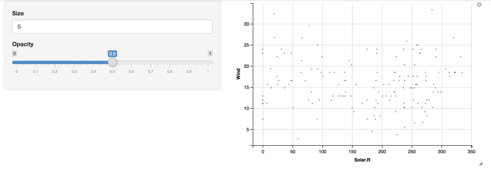
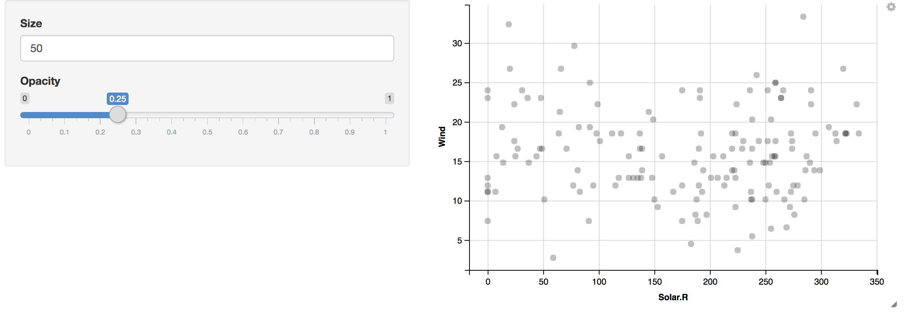

Post 02 - Exploring R Packages: ggvis and ggplot2
================
Donggyun Kim
11/27/2017

1. Introduction
---------------

From the last homework in the class, we learned how to make graphic plots using `ggvis` package. The visualization of ggvis seems apparently similar to that of `ggplot2` package. However, `ggvis` and `ggplot2` have different function interfaces as well as `ggvis` is restricted to basic functions of `ggplot2`. For example, `ggvis` uses `%>%` for the combine operator whereas `ggplot2` uses `+`. In addition, `ggvis` does not have faceting function `ggplot2` has but makes it possible to adjust a size of graphics, which `ggplot2` cannot. In this post, I will talk about processes of data visualization using these two packages and about differences between `ggvis` and `ggplot2`

2. Data Visualization with `ggvis` and `ggplot2`
------------------------------------------------

### 1) Appearance

We first make two simple plots using two packages to see whether their plots looks different. <!--html_preserve-->

<nav class="ggvis-control"> <a class="ggvis-dropdown-toggle" title="Controls" onclick="return false;"></a>
<ul class="ggvis-dropdown">
<li>
Renderer: <a id="plot_id261246335_renderer_svg" class="ggvis-renderer-button" onclick="return false;" data-plot-id="plot_id261246335" data-renderer="svg">SVG</a> | <a id="plot_id261246335_renderer_canvas" class="ggvis-renderer-button" onclick="return false;" data-plot-id="plot_id261246335" data-renderer="canvas">Canvas</a>
</li>
<li>
<a id="plot_id261246335_download" class="ggvis-download" data-plot-id="plot_id261246335">Download</a>
</li>
</ul>
</nav>

<script type="text/javascript">
var plot_id261246335_spec = {
  "data": [
    {
      "name": "dat0",
      "format": {
        "type": "csv",
        "parse": {
          "Ozone": "number",
          "Temp": "number"
        }
      },
      "values": "\"Ozone\",\"Temp\"\n41,67\n36,72\n12,74\n18,62\n0,56\n28,66\n23,65\n19,59\n8,61\n0,69\n7,74\n16,69\n11,66\n14,68\n18,58\n14,64\n34,66\n6,57\n30,68\n11,62\n1,59\n11,73\n4,61\n32,61\n0,57\n0,58\n0,57\n23,67\n45,81\n115,79\n37,76\n0,78\n0,74\n0,67\n0,84\n0,85\n0,79\n29,82\n0,87\n71,90\n39,87\n0,93\n0,92\n23,82\n0,80\n0,79\n21,77\n37,72\n20,65\n12,73\n13,76\n0,77\n0,76\n0,76\n0,76\n0,75\n0,78\n0,73\n0,80\n0,77\n0,83\n135,84\n49,85\n32,81\n0,84\n64,83\n40,83\n77,88\n97,92\n97,92\n85,89\n0,82\n10,73\n27,81\n0,91\n7,80\n48,81\n35,82\n61,84\n79,87\n63,85\n16,74\n0,81\n0,82\n80,86\n108,85\n20,82\n52,86\n82,88\n50,86\n64,83\n59,81\n39,81\n9,81\n16,82\n78,86\n35,85\n66,87\n122,89\n89,90\n110,90\n0,92\n0,86\n44,86\n28,82\n65,80\n0,79\n22,77\n59,79\n23,76\n31,78\n44,78\n21,77\n9,72\n0,75\n45,79\n168,81\n73,86\n0,88\n76,97\n118,94\n84,96\n85,94\n96,91\n78,92\n73,93\n91,93\n47,87\n32,84\n20,80\n23,78\n21,75\n24,73\n44,81\n21,76\n28,77\n9,71\n13,71\n46,78\n18,67\n13,76\n24,68\n16,82\n13,64\n23,71\n36,81\n7,69\n14,63\n30,70\n0,77\n14,75\n18,76\n20,68"
    },
    {
      "name": "scale/x",
      "format": {
        "type": "csv",
        "parse": {
          "domain": "number"
        }
      },
      "values": "\"domain\"\n-8.4\n176.4"
    },
    {
      "name": "scale/y",
      "format": {
        "type": "csv",
        "parse": {
          "domain": "number"
        }
      },
      "values": "\"domain\"\n53.95\n99.05"
    }
  ],
  "scales": [
    {
      "name": "x",
      "domain": {
        "data": "scale/x",
        "field": "data.domain"
      },
      "zero": false,
      "nice": false,
      "clamp": false,
      "range": "width"
    },
    {
      "name": "y",
      "domain": {
        "data": "scale/y",
        "field": "data.domain"
      },
      "zero": false,
      "nice": false,
      "clamp": false,
      "range": "height"
    }
  ],
  "marks": [
    {
      "type": "symbol",
      "properties": {
        "update": {
          "fill": {
            "value": "#000000"
          },
          "size": {
            "value": 50
          },
          "x": {
            "scale": "x",
            "field": "data.Ozone"
          },
          "y": {
            "scale": "y",
            "field": "data.Temp"
          }
        },
        "ggvis": {
          "data": {
            "value": "dat0"
          }
        }
      },
      "from": {
        "data": "dat0"
      }
    }
  ],
  "legends": [],
  "axes": [
    {
      "type": "x",
      "scale": "x",
      "orient": "bottom",
      "layer": "back",
      "grid": true,
      "title": "Ozone"
    },
    {
      "type": "y",
      "scale": "y",
      "orient": "left",
      "layer": "back",
      "grid": true,
      "title": "Temp"
    }
  ],
  "padding": null,
  "ggvis_opts": {
    "keep_aspect": false,
    "resizable": true,
    "padding": {},
    "duration": 250,
    "renderer": "svg",
    "hover_duration": 0,
    "width": 672,
    "height": 480
  },
  "handlers": null
};
ggvis.getPlot("plot_id261246335").parseSpec(plot_id261246335_spec);
</script>
<!--/html_preserve-->
Although the appearances of two plots are similar to each other, the syntax of two functions is different.

### 2) Syntax

This is a code chunk of above two plots. The first plot is made by `ggplot2`, and the second plot by `ggvis`.

``` r
# load two packages
library(ggplot2)
library(ggvis)

# use an R built-in data set "airquality" and convert NA's to zero
dat <- airquality
dat[is.na(airquality)] <- 0

# make the first plot using ggplot()
ggplot(data = dat, aes(x = Ozone, y = Temp)) +
  geom_point()
```

``` r
# make the second plot using ggvis()
ggvis(data = dat, x = ~Ozone, y = ~Temp) %>%
  layer_points()
```

`ggplot()` needs `+` operator to specify the type of graphic while `ggvis()` needs `%>%` operator. Moreover, `ggplot()` needs `aes()` to assign x and y variables of the plot but `ggvis()` needs `~`. For scatter plots, `ggplot()` uses `geom_point()` which is one in `geom_` group whereas `ggvis()` uses `layer_points()` that is one in `layer_` group.

Another difference between `ggvis` and `ggplot2` is that `ggvis` has unlimited hierarchy while `ggplot2` has two level hierarchy: `data` and `aes()`. For example,

``` r
# two hierarchy, data and aes() in ggplot() function
ggplot(data = dat, aes(x = Solar.R, y = Wind, col = Month)) +
  geom_point()
```


``` r
# unlimited hierarchy in ggvis() function
dat %>%
  ggvis(x = ~Solar.R, y = ~Wind, fill = ~Month) %>%
  layer_points()
```

<!--html_preserve-->

<nav class="ggvis-control"> <a class="ggvis-dropdown-toggle" title="Controls" onclick="return false;"></a>
<ul class="ggvis-dropdown">
<li>
Renderer: <a id="plot_id384305349_renderer_svg" class="ggvis-renderer-button" onclick="return false;" data-plot-id="plot_id384305349" data-renderer="svg">SVG</a> | <a id="plot_id384305349_renderer_canvas" class="ggvis-renderer-button" onclick="return false;" data-plot-id="plot_id384305349" data-renderer="canvas">Canvas</a>
</li>
<li>
<a id="plot_id384305349_download" class="ggvis-download" data-plot-id="plot_id384305349">Download</a>
</li>
</ul>
</nav>

<script type="text/javascript">
var plot_id384305349_spec = {
  "data": [
    {
      "name": ".0",
      "format": {
        "type": "csv",
        "parse": {
          "Solar.R": "number",
          "Wind": "number",
          "Month": "number"
        }
      },
      "values": "\"Solar.R\",\"Wind\",\"Month\"\n190,7.4,5\n118,8,5\n149,12.6,5\n313,11.5,5\n0,14.3,5\n0,14.9,5\n299,8.6,5\n99,13.8,5\n19,20.1,5\n194,8.6,5\n0,6.9,5\n256,9.7,5\n290,9.2,5\n274,10.9,5\n65,13.2,5\n334,11.5,5\n307,12,5\n78,18.4,5\n322,11.5,5\n44,9.7,5\n8,9.7,5\n320,16.6,5\n25,9.7,5\n92,12,5\n66,16.6,5\n266,14.9,5\n0,8,5\n13,12,5\n252,14.9,5\n223,5.7,5\n279,7.4,5\n286,8.6,6\n287,9.7,6\n242,16.1,6\n186,9.2,6\n220,8.6,6\n264,14.3,6\n127,9.7,6\n273,6.9,6\n291,13.8,6\n323,11.5,6\n259,10.9,6\n250,9.2,6\n148,8,6\n332,13.8,6\n322,11.5,6\n191,14.9,6\n284,20.7,6\n37,9.2,6\n120,11.5,6\n137,10.3,6\n150,6.3,6\n59,1.7,6\n91,4.6,6\n250,6.3,6\n135,8,6\n127,8,6\n47,10.3,6\n98,11.5,6\n31,14.9,6\n138,8,6\n269,4.1,7\n248,9.2,7\n236,9.2,7\n101,10.9,7\n175,4.6,7\n314,10.9,7\n276,5.1,7\n267,6.3,7\n272,5.7,7\n175,7.4,7\n139,8.6,7\n264,14.3,7\n175,14.9,7\n291,14.9,7\n48,14.3,7\n260,6.9,7\n274,10.3,7\n285,6.3,7\n187,5.1,7\n220,11.5,7\n7,6.9,7\n258,9.7,7\n295,11.5,7\n294,8.6,7\n223,8,7\n81,8.6,7\n82,12,7\n213,7.4,7\n275,7.4,7\n253,7.4,7\n254,9.2,7\n83,6.9,8\n24,13.8,8\n77,7.4,8\n0,6.9,8\n0,7.4,8\n0,4.6,8\n255,4,8\n229,10.3,8\n207,8,8\n222,8.6,8\n137,11.5,8\n192,11.5,8\n273,11.5,8\n157,9.7,8\n64,11.5,8\n71,10.3,8\n51,6.3,8\n115,7.4,8\n244,10.9,8\n190,10.3,8\n259,15.5,8\n36,14.3,8\n255,12.6,8\n212,9.7,8\n238,3.4,8\n215,8,8\n153,5.7,8\n203,9.7,8\n225,2.3,8\n237,6.3,8\n188,6.3,8\n167,6.9,9\n197,5.1,9\n183,2.8,9\n189,4.6,9\n95,7.4,9\n92,15.5,9\n252,10.9,9\n220,10.3,9\n230,10.9,9\n259,9.7,9\n236,14.9,9\n259,15.5,9\n238,6.3,9\n24,10.9,9\n112,11.5,9\n237,6.9,9\n224,13.8,9\n27,10.3,9\n238,10.3,9\n201,8,9\n238,12.6,9\n14,9.2,9\n139,10.3,9\n49,10.3,9\n20,16.6,9\n193,6.9,9\n145,13.2,9\n191,14.3,9\n131,8,9\n223,11.5,9"
    },
    {
      "name": "scale/fill",
      "format": {
        "type": "csv",
        "parse": {
          "domain": "number"
        }
      },
      "values": "\"domain\"\n5\n9"
    },
    {
      "name": "scale/x",
      "format": {
        "type": "csv",
        "parse": {
          "domain": "number"
        }
      },
      "values": "\"domain\"\n-16.7\n350.7"
    },
    {
      "name": "scale/y",
      "format": {
        "type": "csv",
        "parse": {
          "domain": "number"
        }
      },
      "values": "\"domain\"\n0.75\n21.65"
    }
  ],
  "scales": [
    {
      "name": "fill",
      "domain": {
        "data": "scale/fill",
        "field": "data.domain"
      },
      "zero": false,
      "nice": false,
      "clamp": false,
      "range": ["#132B43", "#56B1F7"]
    },
    {
      "name": "x",
      "domain": {
        "data": "scale/x",
        "field": "data.domain"
      },
      "zero": false,
      "nice": false,
      "clamp": false,
      "range": "width"
    },
    {
      "name": "y",
      "domain": {
        "data": "scale/y",
        "field": "data.domain"
      },
      "zero": false,
      "nice": false,
      "clamp": false,
      "range": "height"
    }
  ],
  "marks": [
    {
      "type": "symbol",
      "properties": {
        "update": {
          "size": {
            "value": 50
          },
          "x": {
            "scale": "x",
            "field": "data.Solar\\.R"
          },
          "y": {
            "scale": "y",
            "field": "data.Wind"
          },
          "fill": {
            "scale": "fill",
            "field": "data.Month"
          }
        },
        "ggvis": {
          "data": {
            "value": ".0"
          }
        }
      },
      "from": {
        "data": ".0"
      }
    }
  ],
  "legends": [
    {
      "orient": "right",
      "fill": "fill",
      "title": "Month"
    }
  ],
  "axes": [
    {
      "type": "x",
      "scale": "x",
      "orient": "bottom",
      "layer": "back",
      "grid": true,
      "title": "Solar.R"
    },
    {
      "type": "y",
      "scale": "y",
      "orient": "left",
      "layer": "back",
      "grid": true,
      "title": "Wind"
    }
  ],
  "padding": null,
  "ggvis_opts": {
    "keep_aspect": false,
    "resizable": true,
    "padding": {},
    "duration": 250,
    "renderer": "svg",
    "hover_duration": 0,
    "width": 672,
    "height": 480
  },
  "handlers": null
};
ggvis.getPlot("plot_id384305349").parseSpec(plot_id384305349_spec);
</script>
<!--/html_preserve-->
### 3) Changes in Original Data Set

One of advantages of using `ggvis` against `ggplot2` is that since `ggvis` uses `%>%` operator also used in `dplyr` package, it is possible to put `ggvis` and `dplyr` together.

``` r
# load dplyr package
library(dplyr)

# combine ggvis and dplyr to make a plot
dat %>%
  ggvis(x = ~Solar.R, y = ~Wind) %>%
  # convert mph to km/h using mutate() in dplyr
  mutate(Wind = Wind * 1.61) %>%
  layer_points()
```

<!--html_preserve-->

<nav class="ggvis-control"> <a class="ggvis-dropdown-toggle" title="Controls" onclick="return false;"></a>
<ul class="ggvis-dropdown">
<li>
Renderer: <a id="plot_id310466583_renderer_svg" class="ggvis-renderer-button" onclick="return false;" data-plot-id="plot_id310466583" data-renderer="svg">SVG</a> | <a id="plot_id310466583_renderer_canvas" class="ggvis-renderer-button" onclick="return false;" data-plot-id="plot_id310466583" data-renderer="canvas">Canvas</a>
</li>
<li>
<a id="plot_id310466583_download" class="ggvis-download" data-plot-id="plot_id310466583">Download</a>
</li>
</ul>
</nav>

<script type="text/javascript">
var plot_id310466583_spec = {
  "data": [
    {
      "name": ".0/mutate1",
      "format": {
        "type": "csv",
        "parse": {
          "Solar.R": "number",
          "Wind": "number"
        }
      },
      "values": "\"Solar.R\",\"Wind\"\n190,11.914\n118,12.88\n149,20.286\n313,18.515\n0,23.023\n0,23.989\n299,13.846\n99,22.218\n19,32.361\n194,13.846\n0,11.109\n256,15.617\n290,14.812\n274,17.549\n65,21.252\n334,18.515\n307,19.32\n78,29.624\n322,18.515\n44,15.617\n8,15.617\n320,26.726\n25,15.617\n92,19.32\n66,26.726\n266,23.989\n0,12.88\n13,19.32\n252,23.989\n223,9.177\n279,11.914\n286,13.846\n287,15.617\n242,25.921\n186,14.812\n220,13.846\n264,23.023\n127,15.617\n273,11.109\n291,22.218\n323,18.515\n259,17.549\n250,14.812\n148,12.88\n332,22.218\n322,18.515\n191,23.989\n284,33.327\n37,14.812\n120,18.515\n137,16.583\n150,10.143\n59,2.737\n91,7.406\n250,10.143\n135,12.88\n127,12.88\n47,16.583\n98,18.515\n31,23.989\n138,12.88\n269,6.601\n248,14.812\n236,14.812\n101,17.549\n175,7.406\n314,17.549\n276,8.211\n267,10.143\n272,9.177\n175,11.914\n139,13.846\n264,23.023\n175,23.989\n291,23.989\n48,23.023\n260,11.109\n274,16.583\n285,10.143\n187,8.211\n220,18.515\n7,11.109\n258,15.617\n295,18.515\n294,13.846\n223,12.88\n81,13.846\n82,19.32\n213,11.914\n275,11.914\n253,11.914\n254,14.812\n83,11.109\n24,22.218\n77,11.914\n0,11.109\n0,11.914\n0,7.406\n255,6.44\n229,16.583\n207,12.88\n222,13.846\n137,18.515\n192,18.515\n273,18.515\n157,15.617\n64,18.515\n71,16.583\n51,10.143\n115,11.914\n244,17.549\n190,16.583\n259,24.955\n36,23.023\n255,20.286\n212,15.617\n238,5.474\n215,12.88\n153,9.177\n203,15.617\n225,3.703\n237,10.143\n188,10.143\n167,11.109\n197,8.211\n183,4.508\n189,7.406\n95,11.914\n92,24.955\n252,17.549\n220,16.583\n230,17.549\n259,15.617\n236,23.989\n259,24.955\n238,10.143\n24,17.549\n112,18.515\n237,11.109\n224,22.218\n27,16.583\n238,16.583\n201,12.88\n238,20.286\n14,14.812\n139,16.583\n49,16.583\n20,26.726\n193,11.109\n145,21.252\n191,23.023\n131,12.88\n223,18.515"
    },
    {
      "name": "scale/x",
      "format": {
        "type": "csv",
        "parse": {
          "domain": "number"
        }
      },
      "values": "\"domain\"\n-16.7\n350.7"
    },
    {
      "name": "scale/y",
      "format": {
        "type": "csv",
        "parse": {
          "domain": "number"
        }
      },
      "values": "\"domain\"\n1.2075\n34.8565"
    }
  ],
  "scales": [
    {
      "name": "x",
      "domain": {
        "data": "scale/x",
        "field": "data.domain"
      },
      "zero": false,
      "nice": false,
      "clamp": false,
      "range": "width"
    },
    {
      "name": "y",
      "domain": {
        "data": "scale/y",
        "field": "data.domain"
      },
      "zero": false,
      "nice": false,
      "clamp": false,
      "range": "height"
    }
  ],
  "marks": [
    {
      "type": "symbol",
      "properties": {
        "update": {
          "fill": {
            "value": "#000000"
          },
          "size": {
            "value": 50
          },
          "x": {
            "scale": "x",
            "field": "data.Solar\\.R"
          },
          "y": {
            "scale": "y",
            "field": "data.Wind"
          }
        },
        "ggvis": {
          "data": {
            "value": ".0/mutate1"
          }
        }
      },
      "from": {
        "data": ".0/mutate1"
      }
    }
  ],
  "legends": [],
  "axes": [
    {
      "type": "x",
      "scale": "x",
      "orient": "bottom",
      "layer": "back",
      "grid": true,
      "title": "Solar.R"
    },
    {
      "type": "y",
      "scale": "y",
      "orient": "left",
      "layer": "back",
      "grid": true,
      "title": "Wind"
    }
  ],
  "padding": null,
  "ggvis_opts": {
    "keep_aspect": false,
    "resizable": true,
    "padding": {},
    "duration": 250,
    "renderer": "svg",
    "hover_duration": 0,
    "width": 672,
    "height": 480
  },
  "handlers": null
};
ggvis.getPlot("plot_id310466583").parseSpec(plot_id310466583_spec);
</script>
<!--/html_preserve-->
``` r
# show whether the data is changed
head(dat %>% select(Solar.R, Wind), n = 5)
```

    ##   Solar.R Wind
    ## 1     190  7.4
    ## 2     118  8.0
    ## 3     149 12.6
    ## 4     313 11.5
    ## 5       0 14.3

We can also make the same plot using `ggplot2` and `dplyr`. However,

``` r
# convert mph to km/h
dat <- dat %>% mutate(Wind = Wind * 1.61)

# make a plot using ggplot()
ggplot(dat, aes(x = Solar.R, y = Wind)) +
  geom_point()
```


``` r
# show whether the data is changed
head(dat %>% select(Solar.R, Wind), n = 5)
```

    ##   Solar.R   Wind
    ## 1     190 11.914
    ## 2     118 12.880
    ## 3     149 20.286
    ## 4     313 18.515
    ## 5       0 23.023

we have to change values of original data set (values of `Wind` in above tables) when we want to use `ggplot2`. If we want to keep the original data set, we may want to use `ggvis`.

### 4) Interaction and Faceting

In this section, I will talk about interaction of `ggvis` and faceting of `ggplot2`. Interaction and faceting only belong to `ggvis` and `ggplot2` respectively. Let's talk about interaction first.

**(a) Interaction**

Interaction of `ggvis` makes it possible for variables in plots to interact with each other.

``` r
dat %>%
  ggvis(x = ~Solar.R, y = ~Wind,
        size := input_numeric(5, label = "Size"),
        opacity := input_slider(0, 1, label = "Opacity")
  ) %>%
  layer_points()
```

**Size: 5** and **Opacity: 0.5**  **Size: 50** and **Opacity: 0.25**  You can adjust size and opacity of points in the plot putting numerical values and dragging slide bar in the side panel. You may notice that plots of `ggvis` opens in your web browser like Shiny apps. So, for the interaction part, the plot cannot open in this post (html file). Instead, images of the plot is added.

**(b) Faceting**

As we leaned in early lectures and labs, I will talk briefly about faceting of `ggplot2` for the purpose of introducing a trait that `ggvis` does not have.

``` r
ggplot(dat, aes(x = Solar.R, y = Wind)) +
  geom_point() +
  facet_wrap(~ Month)
```


This can be compared with a plot made by `ggvis`

``` r
dat %>%
  ggvis(x = ~Solar.R, y = ~Wind, fill = ~Month) %>%
  layer_points()
```

<!--html_preserve-->

<nav class="ggvis-control"> <a class="ggvis-dropdown-toggle" title="Controls" onclick="return false;"></a>
<ul class="ggvis-dropdown">
<li>
Renderer: <a id="plot_id757035313_renderer_svg" class="ggvis-renderer-button" onclick="return false;" data-plot-id="plot_id757035313" data-renderer="svg">SVG</a> | <a id="plot_id757035313_renderer_canvas" class="ggvis-renderer-button" onclick="return false;" data-plot-id="plot_id757035313" data-renderer="canvas">Canvas</a>
</li>
<li>
<a id="plot_id757035313_download" class="ggvis-download" data-plot-id="plot_id757035313">Download</a>
</li>
</ul>
</nav>

<script type="text/javascript">
var plot_id757035313_spec = {
  "data": [
    {
      "name": ".0",
      "format": {
        "type": "csv",
        "parse": {
          "Solar.R": "number",
          "Wind": "number",
          "Month": "number"
        }
      },
      "values": "\"Solar.R\",\"Wind\",\"Month\"\n190,11.914,5\n118,12.88,5\n149,20.286,5\n313,18.515,5\n0,23.023,5\n0,23.989,5\n299,13.846,5\n99,22.218,5\n19,32.361,5\n194,13.846,5\n0,11.109,5\n256,15.617,5\n290,14.812,5\n274,17.549,5\n65,21.252,5\n334,18.515,5\n307,19.32,5\n78,29.624,5\n322,18.515,5\n44,15.617,5\n8,15.617,5\n320,26.726,5\n25,15.617,5\n92,19.32,5\n66,26.726,5\n266,23.989,5\n0,12.88,5\n13,19.32,5\n252,23.989,5\n223,9.177,5\n279,11.914,5\n286,13.846,6\n287,15.617,6\n242,25.921,6\n186,14.812,6\n220,13.846,6\n264,23.023,6\n127,15.617,6\n273,11.109,6\n291,22.218,6\n323,18.515,6\n259,17.549,6\n250,14.812,6\n148,12.88,6\n332,22.218,6\n322,18.515,6\n191,23.989,6\n284,33.327,6\n37,14.812,6\n120,18.515,6\n137,16.583,6\n150,10.143,6\n59,2.737,6\n91,7.406,6\n250,10.143,6\n135,12.88,6\n127,12.88,6\n47,16.583,6\n98,18.515,6\n31,23.989,6\n138,12.88,6\n269,6.601,7\n248,14.812,7\n236,14.812,7\n101,17.549,7\n175,7.406,7\n314,17.549,7\n276,8.211,7\n267,10.143,7\n272,9.177,7\n175,11.914,7\n139,13.846,7\n264,23.023,7\n175,23.989,7\n291,23.989,7\n48,23.023,7\n260,11.109,7\n274,16.583,7\n285,10.143,7\n187,8.211,7\n220,18.515,7\n7,11.109,7\n258,15.617,7\n295,18.515,7\n294,13.846,7\n223,12.88,7\n81,13.846,7\n82,19.32,7\n213,11.914,7\n275,11.914,7\n253,11.914,7\n254,14.812,7\n83,11.109,8\n24,22.218,8\n77,11.914,8\n0,11.109,8\n0,11.914,8\n0,7.406,8\n255,6.44,8\n229,16.583,8\n207,12.88,8\n222,13.846,8\n137,18.515,8\n192,18.515,8\n273,18.515,8\n157,15.617,8\n64,18.515,8\n71,16.583,8\n51,10.143,8\n115,11.914,8\n244,17.549,8\n190,16.583,8\n259,24.955,8\n36,23.023,8\n255,20.286,8\n212,15.617,8\n238,5.474,8\n215,12.88,8\n153,9.177,8\n203,15.617,8\n225,3.703,8\n237,10.143,8\n188,10.143,8\n167,11.109,9\n197,8.211,9\n183,4.508,9\n189,7.406,9\n95,11.914,9\n92,24.955,9\n252,17.549,9\n220,16.583,9\n230,17.549,9\n259,15.617,9\n236,23.989,9\n259,24.955,9\n238,10.143,9\n24,17.549,9\n112,18.515,9\n237,11.109,9\n224,22.218,9\n27,16.583,9\n238,16.583,9\n201,12.88,9\n238,20.286,9\n14,14.812,9\n139,16.583,9\n49,16.583,9\n20,26.726,9\n193,11.109,9\n145,21.252,9\n191,23.023,9\n131,12.88,9\n223,18.515,9"
    },
    {
      "name": "scale/fill",
      "format": {
        "type": "csv",
        "parse": {
          "domain": "number"
        }
      },
      "values": "\"domain\"\n5\n9"
    },
    {
      "name": "scale/x",
      "format": {
        "type": "csv",
        "parse": {
          "domain": "number"
        }
      },
      "values": "\"domain\"\n-16.7\n350.7"
    },
    {
      "name": "scale/y",
      "format": {
        "type": "csv",
        "parse": {
          "domain": "number"
        }
      },
      "values": "\"domain\"\n1.2075\n34.8565"
    }
  ],
  "scales": [
    {
      "name": "fill",
      "domain": {
        "data": "scale/fill",
        "field": "data.domain"
      },
      "zero": false,
      "nice": false,
      "clamp": false,
      "range": ["#132B43", "#56B1F7"]
    },
    {
      "name": "x",
      "domain": {
        "data": "scale/x",
        "field": "data.domain"
      },
      "zero": false,
      "nice": false,
      "clamp": false,
      "range": "width"
    },
    {
      "name": "y",
      "domain": {
        "data": "scale/y",
        "field": "data.domain"
      },
      "zero": false,
      "nice": false,
      "clamp": false,
      "range": "height"
    }
  ],
  "marks": [
    {
      "type": "symbol",
      "properties": {
        "update": {
          "size": {
            "value": 50
          },
          "x": {
            "scale": "x",
            "field": "data.Solar\\.R"
          },
          "y": {
            "scale": "y",
            "field": "data.Wind"
          },
          "fill": {
            "scale": "fill",
            "field": "data.Month"
          }
        },
        "ggvis": {
          "data": {
            "value": ".0"
          }
        }
      },
      "from": {
        "data": ".0"
      }
    }
  ],
  "legends": [
    {
      "orient": "right",
      "fill": "fill",
      "title": "Month"
    }
  ],
  "axes": [
    {
      "type": "x",
      "scale": "x",
      "orient": "bottom",
      "layer": "back",
      "grid": true,
      "title": "Solar.R"
    },
    {
      "type": "y",
      "scale": "y",
      "orient": "left",
      "layer": "back",
      "grid": true,
      "title": "Wind"
    }
  ],
  "padding": null,
  "ggvis_opts": {
    "keep_aspect": false,
    "resizable": true,
    "padding": {},
    "duration": 250,
    "renderer": "svg",
    "hover_duration": 0,
    "width": 672,
    "height": 480
  },
  "handlers": null
};
ggvis.getPlot("plot_id757035313").parseSpec(plot_id757035313_spec);
</script>
<!--/html_preserve-->
Faceting makes it easy to analyze the data by categorizing the data value into several groups rather than coloring.

3. Conclusion
-------------

Two packages `ggvis` and `ggplot2` makes it easier to visualize data sets. Each package has its own advantages against the other. I prefer `ggvis` to `ggplot2` because `ggvis` can be combined with `dplyr` functions. However, since `ggvis` is restricted to basic functions of `ggplot2`, it cannot be widely used for some data visualizations such as faceting. Then, what is the solution for this? Using two packages together would make up for each other's weaknesses.

4. References
-------------

[ggvis basics](https://ggvis.rstudio.com/ggvis-basics.html) by RStudio
[ggvis vs ggplot2](https://ggvis.rstudio.com/ggplot2.html) by RStudio
[facets in ggplot2](https://plot.ly/ggplot2/facet/) by plotly
[The ggvis R package - How to Work With The Grammar of Graphics](https://www.youtube.com/watch?v=rf55oB6xX3w) by DataCamp
[Data Visualization in R with ggvis](https://www.youtube.com/watch?v=g4n2B-akEgI) by DevNami
[Introduction to Data Visualization with R and ggplot2](https://www.youtube.com/watch?v=49fADBfcDD4) by Data Science Dojo
[Data Visualization with ggplot2 in R](https://www.youtube.com/watch?v=KukM8a-QPGk) by John Muschelli
[ggvis cookbook](https://ggvis.rstudio.com/cookbook.html) by RStudio
[ggplot2 cheat sheet](https://www.rstudio.com/wp-content/uploads/2015/03/ggplot2-cheatsheet.pdf) by RStudio
